# Data on boarding end2end demo

1. About Dataset bmw-pricing-challenge: https://www.kaggle.com/danielkyrka/bmw-pricing-challenge
2. Provider ingests the data from RDS MySQL and then Provider run pre-processing ETL job. 
3. The process use the Glue Workflow for automation
4. After that, Consumer can search and view the dataset from Catelog
5. Then, Consumer can do Athena query for data exploration
6. Based on query result, Consumer can use the Tableau for virtualization. Or link to SageMaker to simply running data analytics and chart virtualization in Notebook.

Architeture


## Prepare the RDS MySQL connection
RDS MySQL 5.7.26

1. Connect the Mysql and load sample data
```bash

mysql -h $mysqlhost -u dbadmin -p
mysql> create database IF NOT EXISTS demo2ebc DEFAULT CHARSET utf8 COLLATE utf8_general_ci; 
mysql> show databases;
mysql> USE demo2ebc;
mysql> DROP TABLE IF EXISTS `bmw_pricing_challenge`;
mysql> CREATE TABLE `bmw_pricing_challenge` (
 maker_key varchar(3),
 model_key varchar(30),
 mileage int(11),
 engine_power int(11),
 registration_date datetime,
 fuel varchar(13),
 paint_color varchar(5),
 car_type varchar(10),
 feature_1 varchar(10),
 feature_2 varchar(10),
 feature_3 varchar(10),
 feature_4 varchar(10),
 feature_5 varchar(10),
 feature_6 varchar(10),
 feature_7 varchar(10),
 feature_8 varchar(10),
 price int(11),
 sold_at datetime,
 id int(11) NOT NULL AUTO_INCREMENT,
 PRIMARY KEY (`id`)
 )ENGINE=InnoDB DEFAULT CHARSET=utf8mb4;

mysql -h $mysqlhost -u dbadmin -p --local-infile demo2ebc

mysql> LOAD DATA LOCAL INFILE '/home/ec2-user/workspace/glue-streaming-etl-demo/scripts/bmw_pricing_challenge.csv'
 into table bmw_pricing_challenge
 FIELDS TERMINATED BY ',' 
 ENCLOSED BY '"'
 ESCAPED BY ""
 LINES TERMINATED BY '\n'
 IGNORE 1 LINES;
```

2. Add a JDBC connection `mysql5.7demo2ebc` on AWS Glue
Connection properties

| Name    | Type | Require SSL connection |
| ----   | ---- | ---- |
| mysql5.7demo2ebc | JDBC | false |


Connection access

| JDBC URL | Username | VPC Id | Subnet | Security groups |
| ----   | ---- | ---- | ----   | ---- |
| jdbc:mysql://mysqldemohost:3306/demo2ebc | dbadmin | vpc-00d4874adbfc118c0 | subnet-082079fb3f35f20cc | sg-041b990f4d35eaa67 | 

For security group and VPC setting, please check [Setting Up a VPC to Connect to JDBC Data Stores](https://docs.aws.amazon.com/glue/latest/dg/setup-vpc-for-glue-access.html)

3. Test the JDBC connection

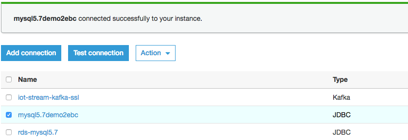

## AWS Glue ETL job read table from an RDS MySQL5.7 database
1. Create Glue sample database `mysql_ingest`

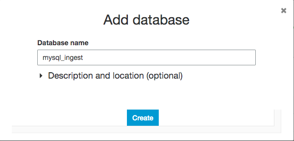

2. Set up the crawler mysql57_bmw_pricing_challenge point to the MySQL tables to build the table metadata in the AWS Glue Data Catalog as a data source

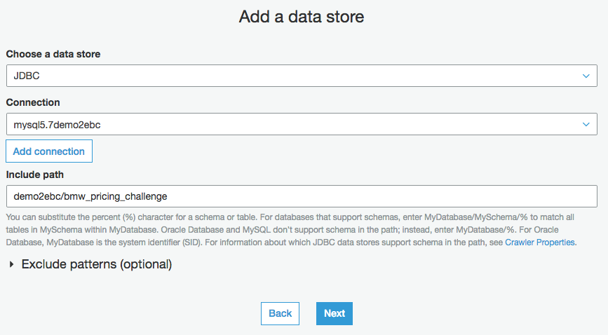

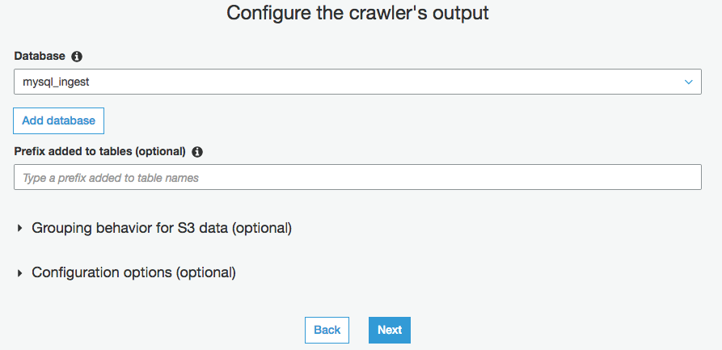

3. Run the crawler mysql57_bmw_pricing_challenge to generate the table schema and metadata in AWS Glue Data Catalog

Table: demo2ebc_bmw_pricing_challenge

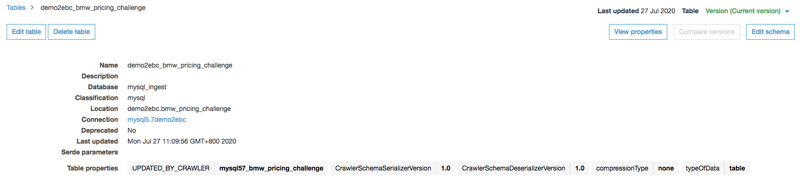

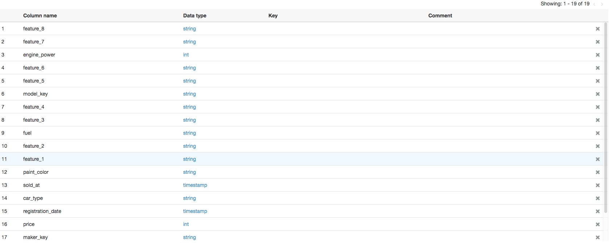

4. Create the ETL job mysql57_bmw_pricing_challenge
```bash
1. Job name: mysql57_bmw_pricing_challenge
2. Choose a data source: table `demo2ebc_bmw_pricing_challenge` created by crawler
3. For the data target, choose Create tables in your data target. Then choose S3 Target path for raw data source layer, and Format as CSV
4. Leave the default data mappings, and finish creating the ETL job.
```

5. Run the ETL Job, verify the data created in S3 bucket for data source layer

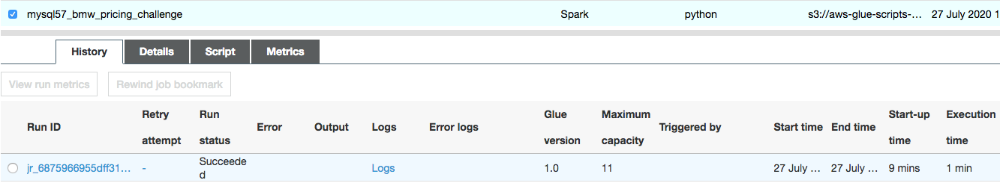

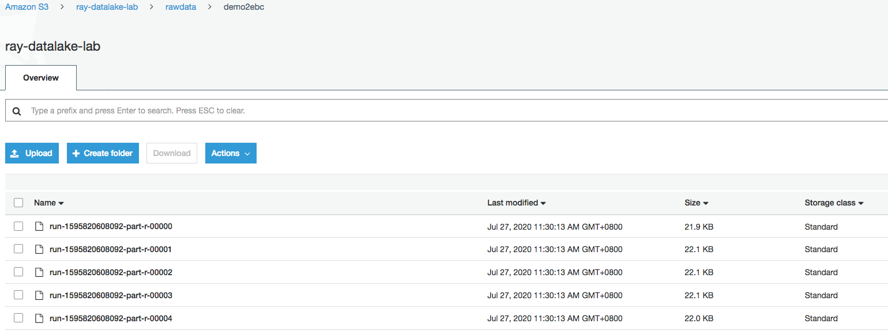

6. An AWS Glue ETL job enrich data and convert to Parquet format
 - Create ETL job `mysql57_bmw_pricing_challenge_parquet`

```bash
1. Job name: mysql57_bmw_pricing_challenge_parquet
2. Choose a data source: table `demo2ebc_bmw_pricing_challenge`
3. For the data target, choose Create tables in your data target. Then choose S3 Target path for sementic layer, and Format as Parquet
4. Leave the default data mappings, and finish creating the ETL job.
```

7. Run the ETL Job, verify the data created in S3 bucket for sementic layer

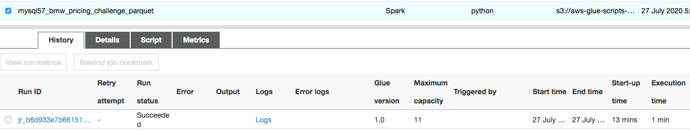

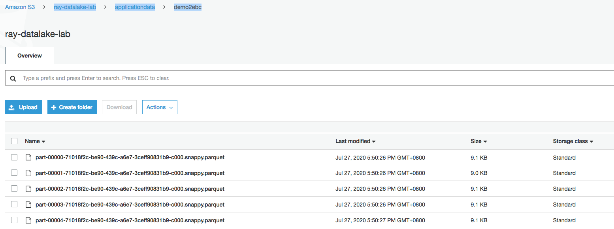


8. Create Glue Workflow

If you need to deal with the dependencies between tasks for complex data processing processes. Glue's workflow function can solve upstream and downstream dependencies and timing issues.

- Create the Workflow


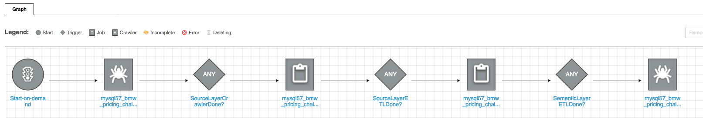

- Run the Workflow
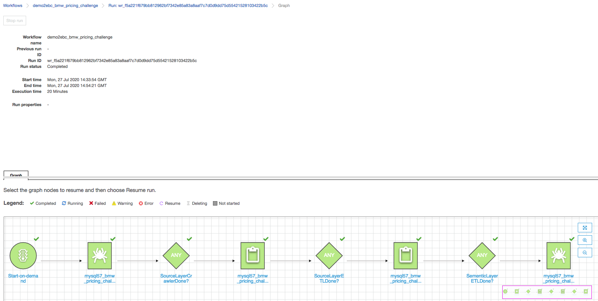


## Consumer can do Athena query for data exploration

- Run an SQL query over the partitioned Parquet data in the Athena.

```bash
SELECT * FROM "mysql_ingest"."bmw_pricing_challenge_parquet_demo2ebc" limit 10;
```

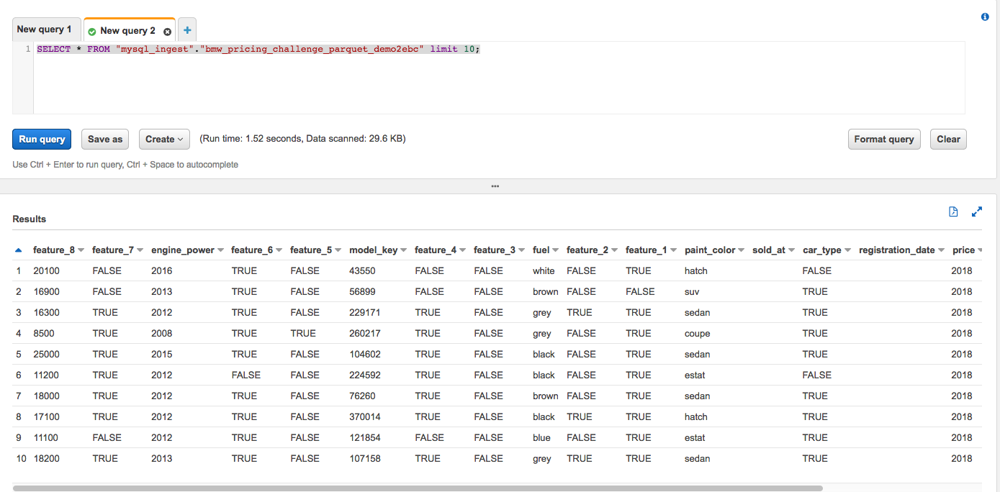

## Consumer can use the Tableau for virtualization