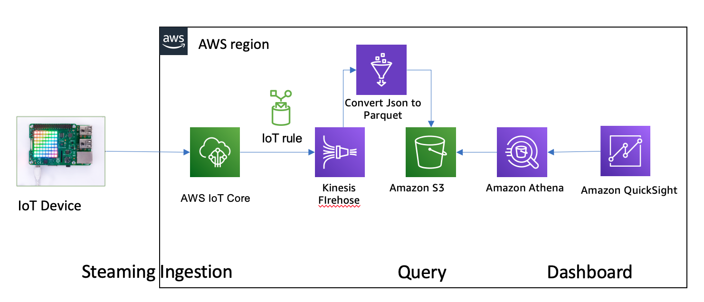
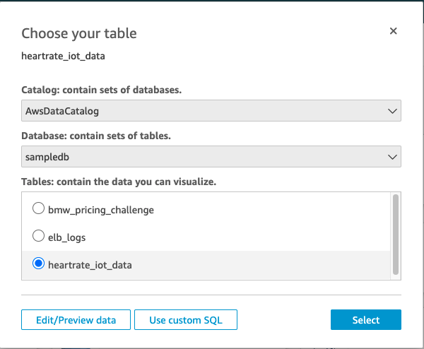
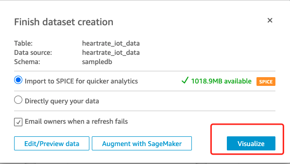
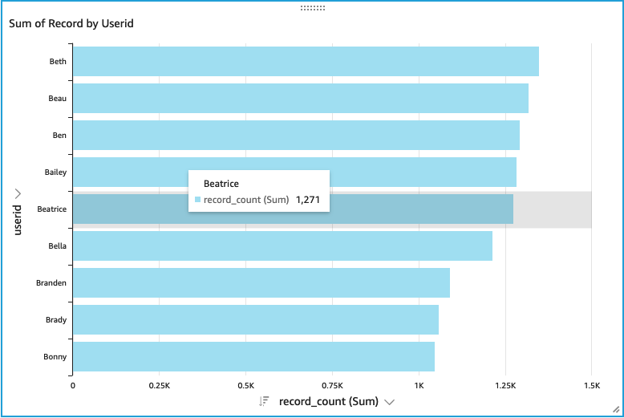
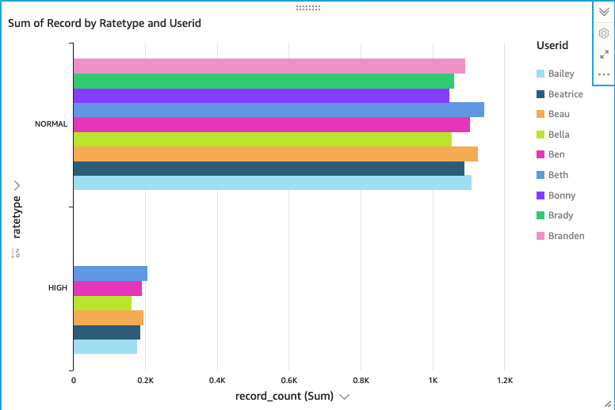

# IoT-Athena-QuickSight

In this post, I show how you can build a business intelligence capability for streaming IoT device data using AWS IoT Core, Amazon Firehose, Amazon S3, Amazon Athena and Amazon QuickSight.

In this walkthrough, you run a script to mimic multiple sensors publishing messages on an IoT MQTT topic, with one message published every second. The events get sent to AWS IoT, where an IoT rule is configured to send all message to Firehose. From there, Firehose writes the messages in batches to objects stored in S3.  In S3, you set up a table in Athena and use QuickSight to analyze the IoT data.

Archiecture for IoT-Athena-QuickSight



## Configuring Firehose to write to S3
- Kinesis Firehose Delivery Steam Name: `IoT-to-BI-Example`
- S3 Bucket: `your bucket`
- S3 Prefix: `iot_to_bi_example/`

## Configuring the AWS IoT rule
- Name: `Iot_to_bi_demoRule`
- Attribute: *
- Topic Filter: `/health/#`
- Add Action: `Send messages to an Amazon Kinesis Firehose stream (from previous section).`
- Select Separator: `"\n (newline)"`

## Generating sample data
Running the heartrate.py python script generates fictitious IoT messages. 

[heartrate.py](scripts/heartrate.py)

```bash
python hearrate.py
{"heartRate": 72, "userId": "Brady", "rateType": "NORMAL", "dateTime": "2021-03-03 15:20:35"}
{"heartRate": 78, "userId": "Beatrice", "rateType": "NORMAL", "dateTime": "2021-03-03 15:20:36"}
{"heartRate": 65, "userId": "Beatrice", "rateType": "NORMAL", "dateTime": "2021-03-03 15:20:37"}
{"heartRate": 96, "userId": "Bonny", "rateType": "NORMAL", "dateTime": "2021-03-03 15:20:38"}
```

## Configuring Athena
1. Create a table using the following query
```sql
CREATE EXTERNAL TABLE heartrate_iot_data (
    heartRate int,
    userId string,
    rateType string,
    dateTime timestamp)
ROW FORMAT  serde 'org.apache.hive.hcatalog.data.JsonSerDe'
with serdeproperties( 'ignore.malformed.json' = 'true' )
LOCATION 's3://<CREATED-BUCKET>/iot_to_bi_example/'
```

2. Create the query
```sql
# count the user heart rate data
SELECT userid, COUNT(userid) FROM heartrate_iot_data GROUP BY userid

# Create View
CREATE OR REPLACE VIEW "hearrate_iot_info" AS
SELECT userid, rateType, COUNT(userid) as record_count FROM heartrate_iot_data GROUP BY userid, rateType
```

## Analyzing the data on QuickSight

1. Set up a data source from Athena `heartrate_iot_data` table


2. Build an analysis
- Choose Visualize

    The `Edit/Preview` data button allows you to prepare the dataset differently prior to visualizing it. Examples include being able to format and transform your data, create alias data fields, change data types, and filter or join your data. Here we keey everything as default

    

- Count of records by UserId


- Count of record by userid and ratetype


# Reference
[Derive Insights from IoT in Minutes](https://aws.amazon.com/blogs/big-data/derive-insights-from-iot-in-minutes-using-aws-iot-amazon-kinesis-firehose-amazon-athena-and-amazon-quicksight/)