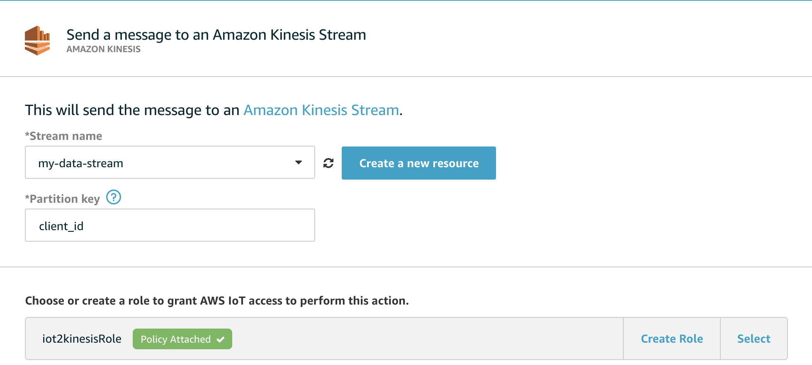
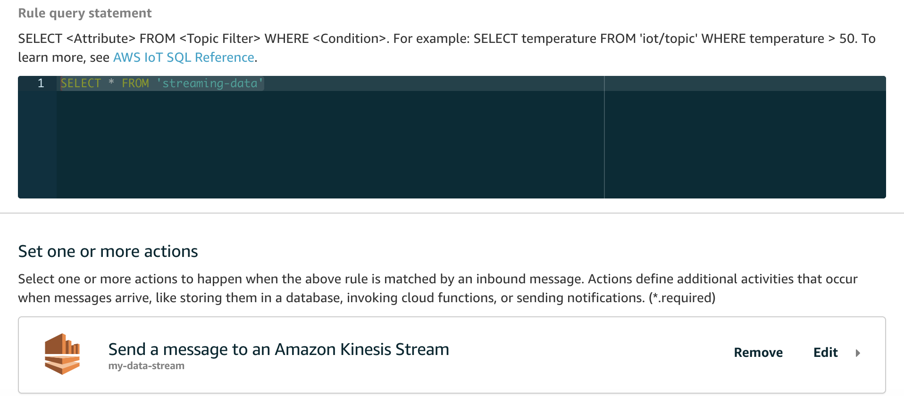
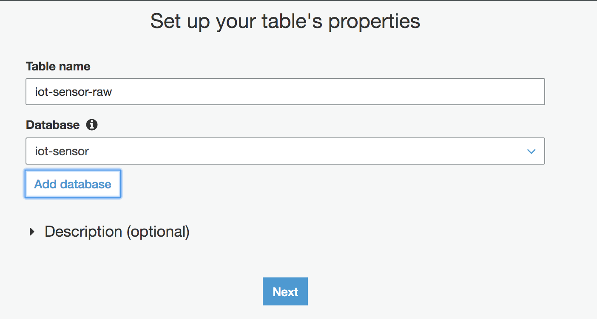
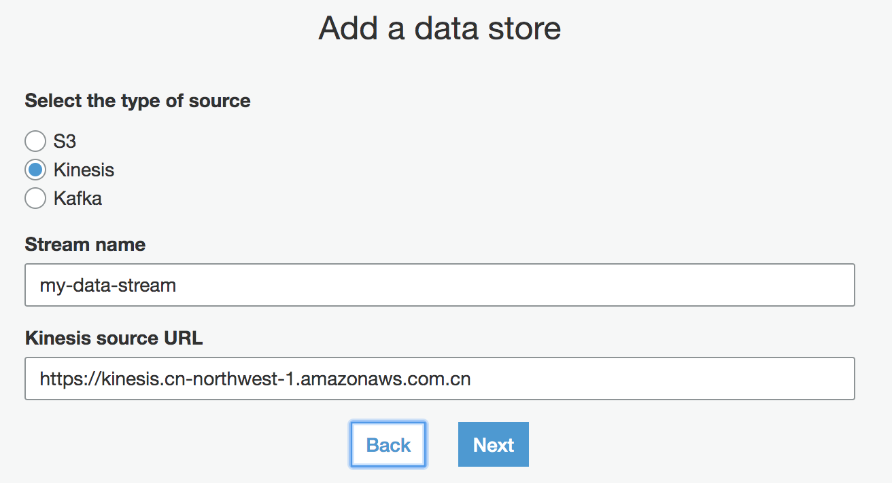
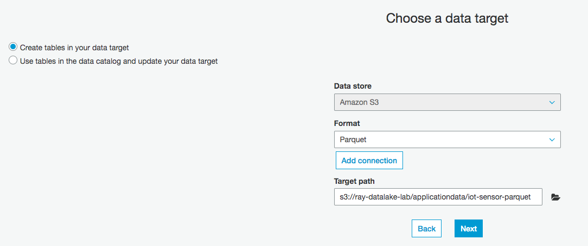
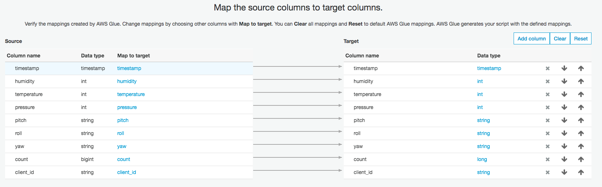
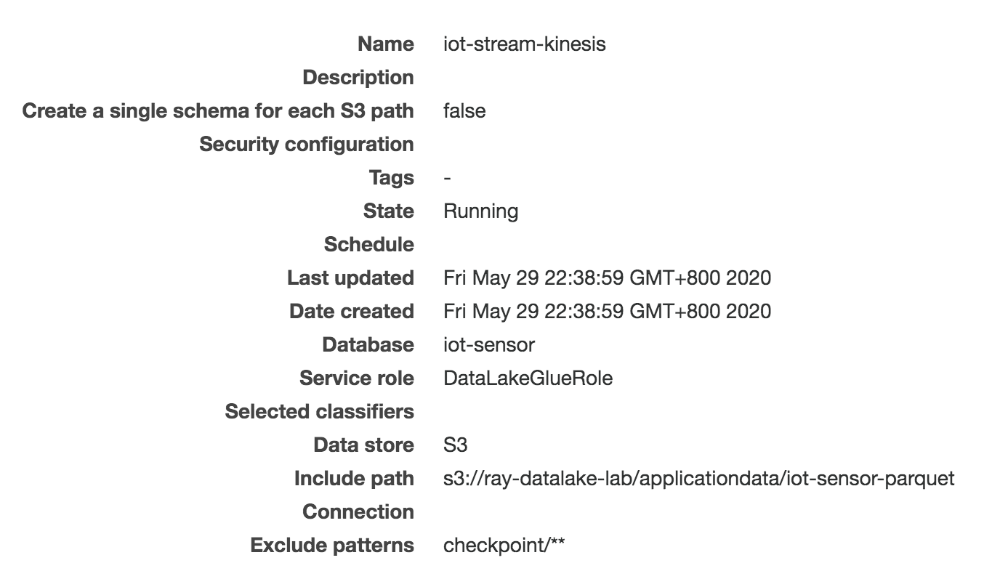
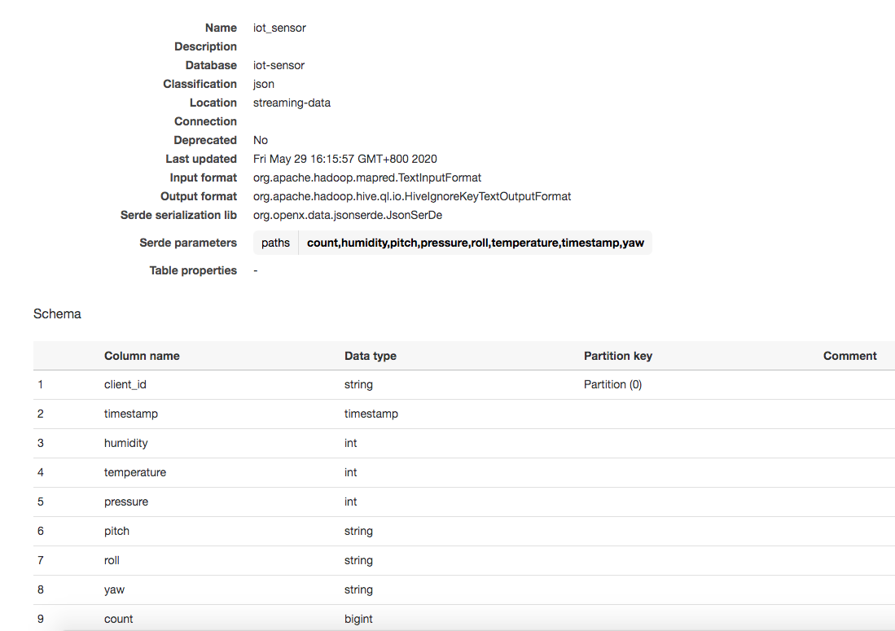

# glue-streaming-etl-demo

## IoT - Kinesis - Glue Streaming - Athena demo

[Detail guide](https://aws.amazon.com/blogs/aws/new-serverless-streaming-etl-with-aws-glue/)

Archiecture


# Generate the stream IoT events

1. Create the IoT Thing glue-demo-iot by follow up [IoT Core Getting Start](https://docs.aws.amazon.com/iot/latest/developerguide/iot-gs.html)

2. Put the certificates under iot folder

3. Update the code endpoint and certificates file name
```bash
# Get the IoT endpoint
aws iot describe-endpoint --endpoint-type iot:Data-ATS --region cn-northwest-1
```

4. Install dependency
```bash
pip install -r scripts/requirements.txt
```

5. Run code to send, once per second, a JSON message with sensor data to the `streaming-data` MQTT topic. 
```bash
cd scripts
python scripts/iot-mqtt-producer.py
```

6. Check the IoT console -> Test, subscribe the `streaming-data` MQTT topic, make sure the message can be print out
```json
{
  "client_id": "raspberrypi",
  "timestamp": "2020-05-26 11:19:14",
  "humidity": 49,
  "temperature": 7,
  "pressure": 450,
  "pitch": "sample",
  "roll": "demo",
  "yaw": "test",
  "count": 39
}
```

# Use the kinesis to collect data

1. In the Kinesis console, create the `my-data-stream` data stream (1 shard is enough). 

2. Back in the AWS IoT console, create an IoT rule to send all data from the MQTT topic to this Kinesis data stream.
```bash
SELECT * FROM 'streaming-data'
```





# Processing Streaming Data with AWS Glue

1. I manually add a table in the Glue Data Catalog.
- Click Database and Add database, to create a new database `iot_sensor`.
- Click Tables and Add tables, to add a new table `iot_sensor_raw`



- Data Source: `my-data-stream` kinesis stream https://kinesis.cn-northwest-1.amazonaws.com.cn



- Format: json
- table
```json
iot_sensor_raw = {
            "client_id": string, partition
            "timestamp": timestamp,
            "humidity": int,
            "temperature": int,
            "pressure": int,
            "pitch": string,
            "roll": string,
            "yaw": string,
            "count": bigint
        }
```        

2. Create Glue Streaming ETL job. 

- The IAM role with `AWSGlueServiceRole` and `AmazonKinesisReadOnlyAccess` managed policies. 
- Create Glue Streaming job with name `iot-sensor-streaming-job`, 
    - Select the type as `Spark Streaming` 
    - For the data source, select the table `iot_sensor` as just created, receiving data from the Kinesis stream.
    - As target, create a new table in the Glue Data Catalog, using `Apache Parquet` format. The Parquet files generated by this job are going to be stored in an S3 bucket
    
    - Leave the default mapping that keeps in output all the columns in the source stream. 
    
    - Start the job, and after a few minutes, check the Parquet files containing the output of the job appearing in the output S3 bucket. They are partitioned by ingest date (year, month, day, and hour).

Check the cloudwatch logs
```
20/05/29 14:33:25 INFO MultipartUploadOutputStream: close closed:false s3://ray-datalake-lab/applicationdata/iot-sensor-parquet/ingest_year=2020/ingest_month=05/ingest_day=29/ingest_hour=14/.....parquet
FileOutputCommitter: Saved output of task 'attempt_20200529143324_0007_m_000000_7' to s3://ray-datalake-lab/applicationdata/iot-sensor-parquet/ingest_year=2020/ingest_month=05/ingest_day=29/ingest_hour=14
```

3. Configure Crawler to populate the Glue Data Catalog with target parquet tables `iot_sensor_kinesis`

In the crawler configuration, exclude the checkpoint folder used by Glue to keep track of the data that has been processed. 



After the crawler execution complete, you can check the table schema.  They are partitioned by ingest date (year, month, day, and hour)



# Query the data from Athena
```bash
SELECT * FROM "iot-sensor"."iot_sensor_parquet" limit 10;

Select count(1) from "iot-sensor"."iot_sensor_parquet";
```