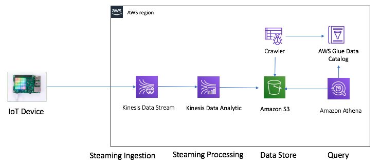
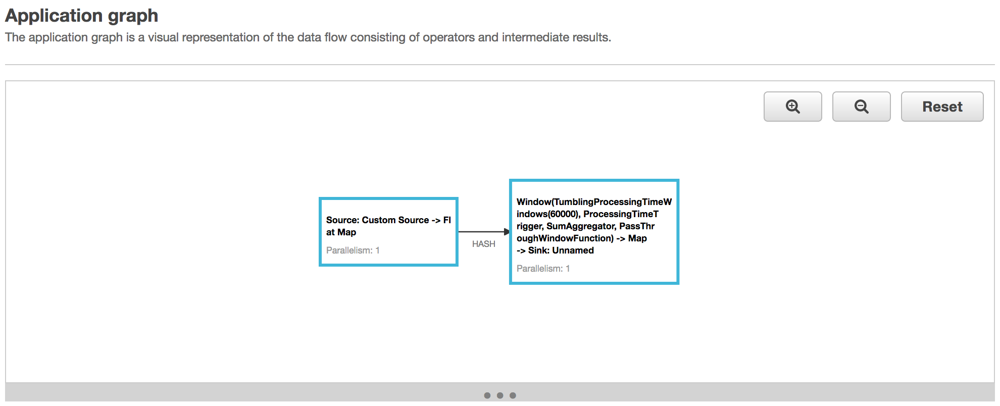
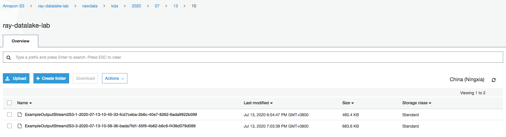
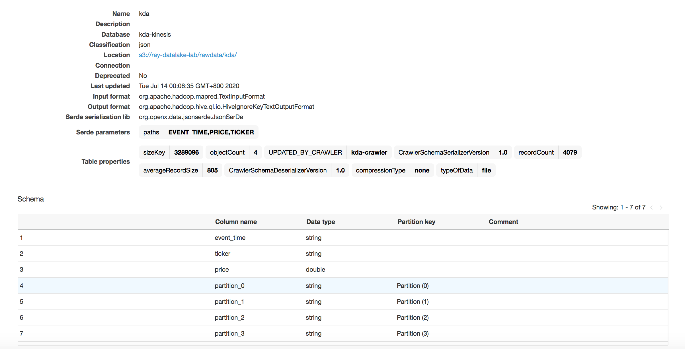
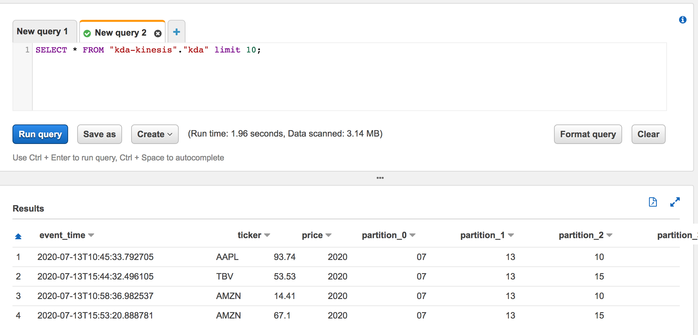
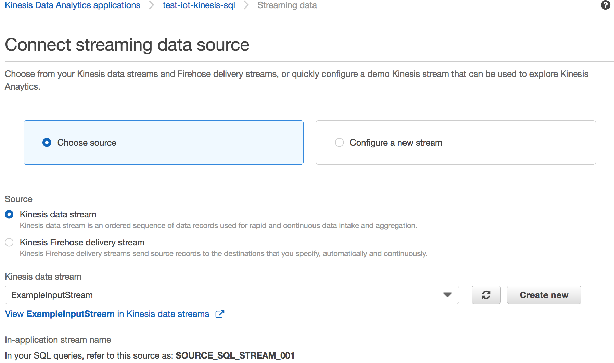
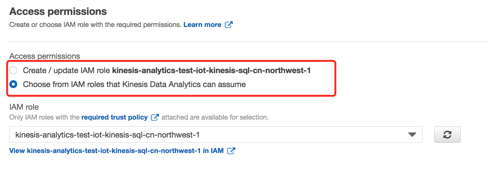
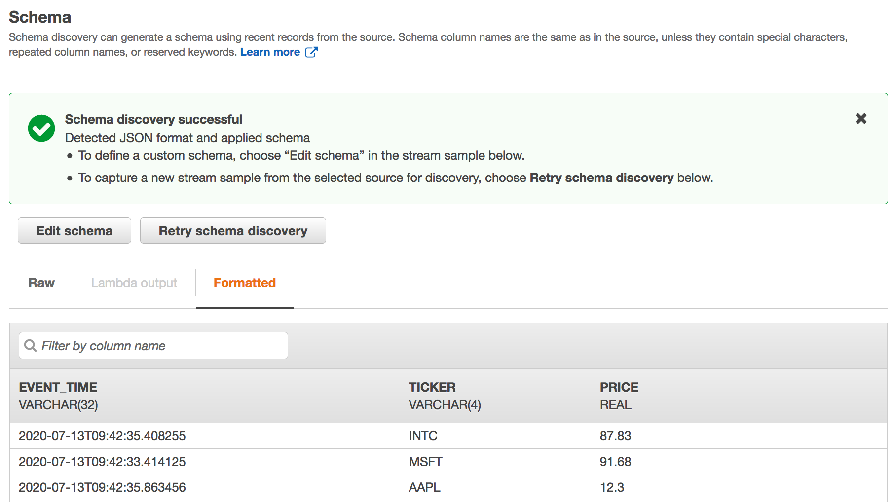
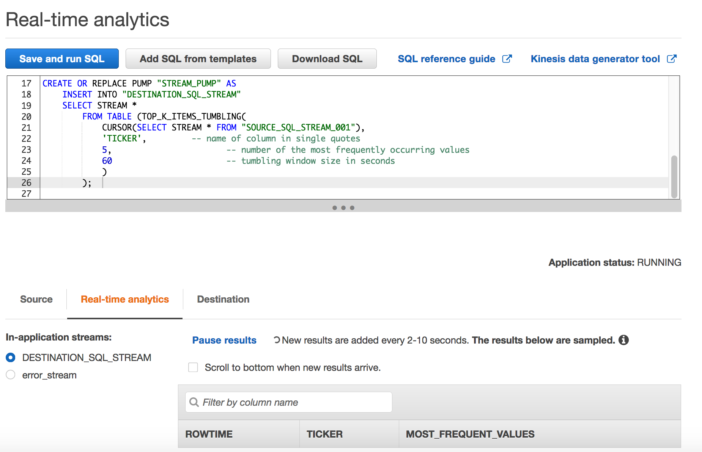

# Kinesis Data Stream - Kinesis Data Analytics - demo

## IoT - Kinesis Data Stream - Kinesis Data Analytics - Athena Archiecture



## Create Two Amazon Kinesis Data Streams
```bash
aws kinesis create-stream \
--stream-name ExampleInputStream \
--shard-count 1 \
--region cn-northwest-1

aws kinesis create-stream \
--stream-name ExampleOutputStream \
--shard-count 1 \
--region cn-northwest-1
```

Optional: If you running sample applicaiton in amazon-kinesis-data-analytics-java-examples/GettingStarted. Please Create the Kinesis Data Firehose delivery stream ExampleOutputStream2S3 which write ExampleOutputStream data to S3 bucket


## Write Sample Records to the Input Stream 
1. login to EC2 or Cloud9 IDE

2. run the stock.py script to send data to the Kinesis Input Stream

```bash
python stock.py
```

## Create the Application Code
1. Install maven
```bash
sudo amazon-linux-extras enable corretto8
sudo yum install -y java-1.8.0-amazon-corretto-devel
wget http://ftp.meisei-u.ac.jp/mirror/apache/dist/maven/maven-3/3.6.3/binaries/apache-maven-3.6.3-bin.tar.gz
tar -zxf apache-maven-3.6.3-bin.tar.gz
export JAVA_HOME="/usr/lib/jvm/java-1.8.0-amazon-corretto.x86_64"
PATH=$JAVA_HOME/bin:$PATH
export PATH=/home/ec2-user/apache-maven-3.6.3/bin:$PATH
```

2. Compile the Application Code 
```bash
git clone https://github.com/aws-samples/amazon-kinesis-data-analytics-java-examples
cd amazon-kinesis-data-analytics-java-examples/S3Sink

Modify the S3StreamingSinkJob.java
private static final String s3SinkPath = "s3a://kda-app-code-ruiliang/data";

mvn package -Dflink.version=1.8.2

# The output jar
target/aws-kinesis-analytics-java-apps-1.0.jar
```

If you encounter error "Could not resolve dependencies for project your project name: Failure to find org.apache.flink:flink-connector-kinesis_2.11:jar:1.8.2 in https://repo.maven.apache.org/maven2 was cached in the local repository, resolution will not be reattempted until the update interval of central has elapsed or updates are forced", please follow up the guide [Troubleshooting Kinesis Data Analytics for Apache Flink](https://docs.aws.amazon.com/kinesisanalytics/latest/java/troubleshooting.html) to install the connector.

```bash
sudo cp flink-connector-kinesis_2.11-1.8.2.jar ~/.m2/repository/org/apache/flink/flink-connector-kinesis_2.11/1.8.2/
```

3. Upload the Apache Flink Streaming Java Code

Upload aws-kinesis-analytics-java-apps-1.0.jar to S3 bucket
```bash
aws s3 cp target/aws-kinesis-analytics-java-apps-1.0.jar s3://kda-app-code-ruiliang/kinesis/aws-kinesis-analytics-java-apps-1.0.jar
```

## Create and Run the Kinesis Data Analytics Application 
1. Create the IAM permissions policy KAReadSourceStreamWriteSinkStream (Used for amazon-kinesis-data-analytics-java-examples/GettingStarted)
```json
{
    "Version": "2012-10-17",
    "Statement": [
        {
            "Sid": "S3",
            "Effect": "Allow",
            "Action": [
                "s3:Abort*",
                "s3:DeleteObject*",
                "s3:GetObject*",
                "s3:GetBucket*",
                "s3:List*",
                "s3:ListBucket",
                "s3:PutObject"
            ],
            "Resource": ["arn:aws-cn:s3:::kda-app-code-ruiliang",
                "arn:aws-cn:s3:::kda-app-code-ruiliang/*"
            ]
        },
        {
            "Sid": "ReadInputStream",
            "Effect": "Allow",
            "Action": "kinesis:*",
            "Resource": "arn:aws-cn:kinesis:cn-northwest-1:012345678901:stream/ExampleInputStream"
        },
        {
            "Sid": "WriteOutputStream",
            "Effect": "Allow",
            "Action": "kinesis:*",
            "Resource": "arn:aws:kinesis:cn-northwest-1:012345678901:stream/ExampleOutputStream"
        }
    ]
}

2. Create the IAM permissions policy KAReadSourceStreamWriteSinkS3 (Used for amazon-kinesis-data-analytics-java-examples/S3Sink)
{
    "Version": "2012-10-17",
    "Statement": [
        {
            "Sid": "ReadCode",
            "Effect": "Allow",
            "Action": [
                "s3:GetObject",
                "s3:GetObjectVersion"
            ],
            "Resource": [
                "arn:aws-cn:s3:::kda-app-code-ruiliang",
                "arn:aws-cn:s3:::kda-app-code-ruiliang/*"
            ]
        },
        {
            "Sid": "ListCloudwatchLogGroups",
            "Effect": "Allow",
            "Action": [
                "logs:DescribeLogGroups"
            ],
            "Resource": [
                "arn:aws-cn:logs:cn-northwest-1:012345678901:log-group:*"
            ]
        },
        {
            "Sid": "ListCloudwatchLogStreams",
            "Effect": "Allow",
            "Action": [
                "logs:DescribeLogStreams"
            ],
            "Resource": [
                "arn:aws-cn:logs:cn-northwest-1:012345678901:log-group:/aws/kinesis-analytics/test-iot-kinesis:log-stream:*"
            ]
        },
        {
            "Sid": "PutCloudwatchLogs",
            "Effect": "Allow",
            "Action": [
                "logs:PutLogEvents"
            ],
            "Resource": [
                "arn:aws-cn:logs:cn-northwest-1:012345678901:log-group:/aws/kinesis-analytics/test-iot-kinesis:log-stream:kinesis-analytics-log-stream"
            ]
        },
        {
            "Sid": "ReadInputStream",
            "Effect": "Allow",
            "Action": "kinesis:*",
            "Resource": "arn:aws-cn:kinesis:cn-northwest-1:012345678901:stream/ExampleInputStream"
        },
        {
            "Sid": "WriteObjects",
            "Effect": "Allow",
            "Action": [
                "s3:Abort*",
                "s3:DeleteObject*",
                "s3:GetObject*",
                "s3:GetBucket*",
                "s3:List*",
                "s3:ListBucket",
                "s3:PutObject"
            ],
            "Resource": [
                "arn:aws-cn:s3:::kda-app-code-ruiliang",
                "arn:aws-cn:s3:::kda-app-code-ruiliang/*"
            ]
        }
    ]
}
```

2. Create the IAM Role KA-stream-rw-role for kinesisanalytics.amazonaws.com service with KAReadSourceStreamWriteSinkStream policy and KAReadSourceStreamWriteSinkS3 policy

3. Create the Kinesis Data Analytics Application properties create_request.json
```json
{
    "ApplicationName": "test-iot-kinesis",
    "ApplicationDescription": "my iot kinesis test app",
    "RuntimeEnvironment": "FLINK-1_8",
    "ServiceExecutionRole": "arn:aws-cn:iam::012345678901:role/KA-stream-rw-role",
    "ApplicationConfiguration": {
        "ApplicationCodeConfiguration": {
            "CodeContent": {
                "S3ContentLocation": {
                    "BucketARN": "arn:aws-cn:s3:::kda-app-code-ruiliang",
                    "FileKey": "kinesis/aws-kinesis-analytics-java-apps-1.0.jar"
                }
            },
            "CodeContentType": "ZIPFILE"
        },
        "EnvironmentProperties":  { 
         "PropertyGroups": [ 
            { 
               "PropertyGroupId": "ProducerConfigProperties",
               "PropertyMap" : {
                    "flink.stream.initpos" : "LATEST",
                    "aws.region" : "cn-northwest-1",
                    "AggregationEnabled" : "false"
               }
            },
            { 
               "PropertyGroupId": "ConsumerConfigProperties",
               "PropertyMap" : {
                    "aws.region" : "cn-northwest-1"
               }
            }
         ]
      }
    }
}
```

4. create the application
```bash
aws kinesisanalyticsv2 create-application --cli-input-json file://create_request.json
```

5. Configure the Application

    On the test-iot-kinesis page, choose Configure.

    Under Monitoring, ensure that the Monitoring metrics level is set to Application.

    For CloudWatch logging, select the Enable check box.

    Choose Update. 

6. Start the Application 

Create the start properties start_request.json

```json
{
    "ApplicationName": "test-iot-kinesis",
    "RunConfiguration": {
        "ApplicationRestoreConfiguration": { 
         "ApplicationRestoreType": "RESTORE_FROM_LATEST_SNAPSHOT"
         }
    }
}
```

start the application

```bash
aws kinesisanalyticsv2 start-application --cli-input-json file://start_request.json
```

Application running and you can check the application graph


6. Stop the Application

Create the stop properties stop_request.json

```json
{
    "ApplicationName": "test-iot-kinesis"
}
```

stop the application

```bash
aws kinesisanalyticsv2 stop-application --cli-input-json file://stop_request.json
```


## Query the ingested data

Once the data ingested into S3 bucket, you can query data from Athena

1. S3 bucket for ingest data



2. Glue catelog



3. Athena result



## SQL Analytics Applicaiton

You can also create the SQL Analytics Applicaiton in Kinesis Data Analytics if you just want to write the SQL to do real-time analysis.

1. Create SQL application



2. Connect to source stream and Click Discover Schema



3. Save and continue

4. Go to SQL editor

Example: Retrieving the Most Frequently Occurring Values

```sql
CREATE OR REPLACE STREAM DESTINATION_SQL_STREAM (
  "TICKER" VARCHAR(4), 
  "MOST_FREQUENT_VALUES" BIGINT
);

CREATE OR REPLACE PUMP "STREAM_PUMP" AS 
    INSERT INTO "DESTINATION_SQL_STREAM"
    SELECT STREAM * 
        FROM TABLE (TOP_K_ITEMS_TUMBLING(
            CURSOR(SELECT STREAM * FROM "SOURCE_SQL_STREAM_001"),
            'TICKER',         -- name of column in single quotes
            5,                       -- number of the most frequently occurring values
            60                       -- tumbling window size in seconds
            )
        );  
```

Choose Save and run SQL.



5. On the Real-time analytics tab, you can see all the in-application streams that the application created and verify the data.



## Clean up

- Delete Your Kinesis Data Analytics Application
- Delete Your Kinesis Data Streams
- Delete Your Amazon S3 Object and Bucket
- Delete Your IAM Resources
- Delete Your CloudWatch Resources

## Reference
[Amazon Kinesis Data Analytics for SQL Applications Developer Guide](https://docs.aws.amazon.com/kinesisanalytics/latest/dev/examples.html)