# Glue ingest MySQL5.7 via Glue connector

Architeture


## Prepare the RDS MySQL connection
RDS MySQL 5.7.22

1. Connect the Mysql and load sample data
```bash

mysql -h $mysqlhost -u dbadmin -p
mysql> source mysqlsampledatabase.sql
mysql> show databases;
mysql> USE classicmodels;
mysql> SELECT * FROM customers;
```

2. Add a JDBC connection `rds-mysql5.7`
```bash
#JDBC URL
jdbc:mysql://$mysqlhost:3306/classicmodels

# Security group
3306 port
```
For security group and VPC setting, please check [Setting Up a VPC to Connect to JDBC Data Stores](https://docs.aws.amazon.com/glue/latest/dg/setup-vpc-for-glue-access.html)

[Glue Connection Properties details](https://docs.aws.amazon.com/glue/latest/dg/connection-defining.html#connection-properties-jdbc)

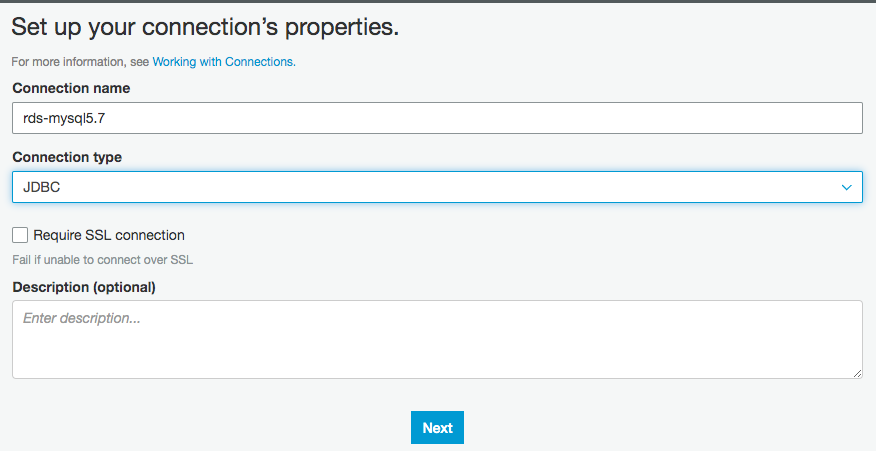

3. Test the JDBC connection

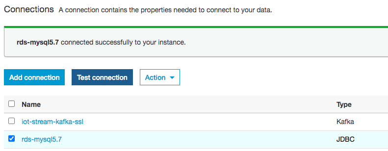

## An AWS Glue ETL job loads CSV data from an S3 bucket to RDS MySQL database
1. Download the [downloading the sample CSV data file](https://www.census.gov/data/datasets/2012/econ/cfs/2012-pums-files.html). Unzip it and upload it to S3 bucket

2. Create Glue sample database `mysql_ingest`


3. Set up the Crawler and populate the table metadata in the AWS Glue Data Catalog for the sample csv file data. 

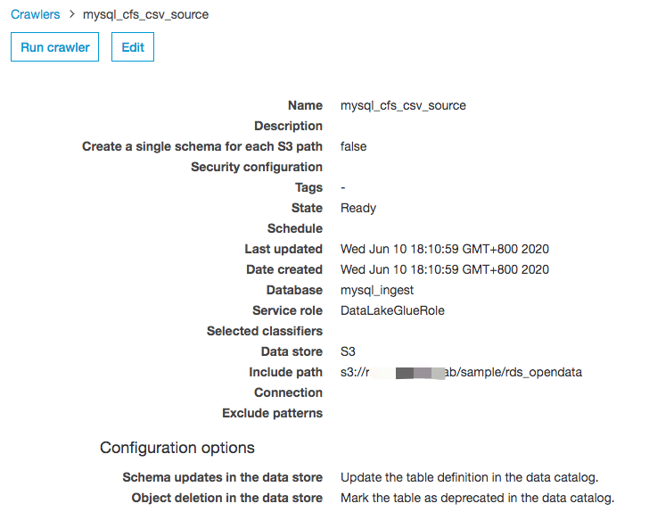

4. Run the Crawler and populate the table metadata in the AWS Glue Data Catalog

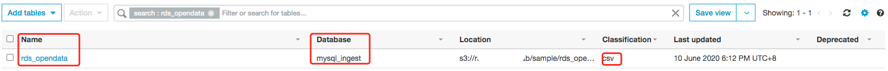

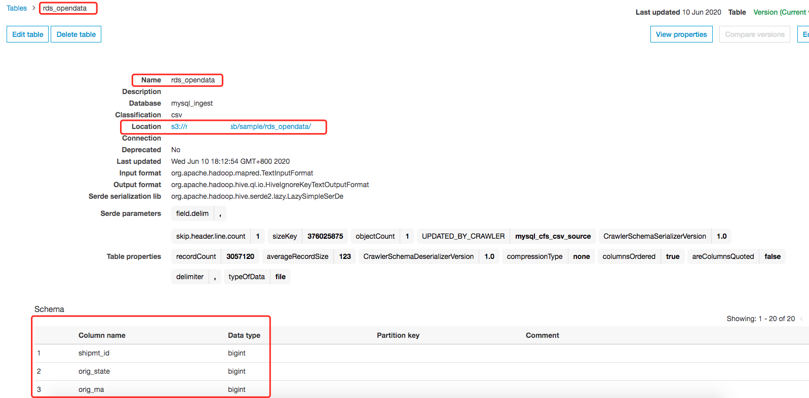

5. Create an ETL job to load the data from S3 to a single table in the target RDS MySQL database via the JDBC connection.
```bash
1. Job name: cfs_full_s3_to_mysql5.7
2. Choose a data source: rds_opendata created by crawler
3. For the data target, choose Create tables in your data target. Then choose JDBC connection, choose the JDBC connection  `rds-mysql5.7` that created earlier with database name `classicmodels`.
4. Leave the default data mappings, and finish creating the ETL job.
```


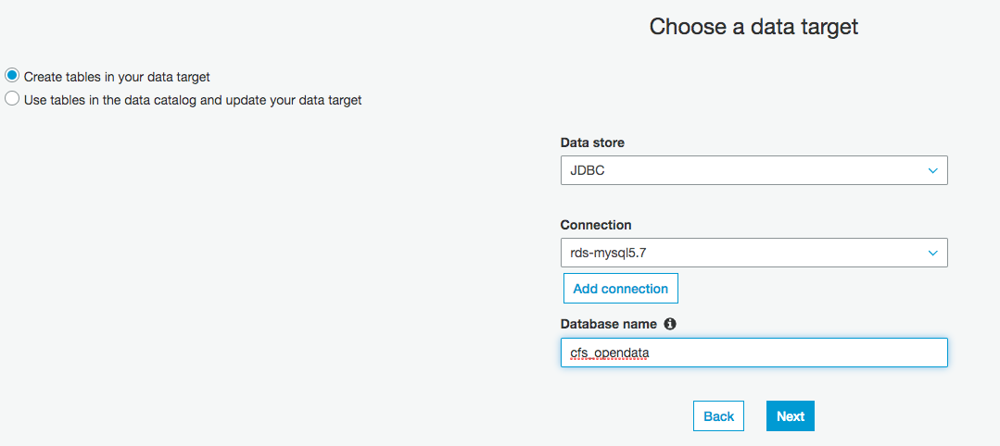

6. Run the ETL Job

7. Check the MySQL 5.7 
```bash
mysql> USE classicmodels;
Database changed
mysql> show tables;
+-------------------------+
| Tables_in_classicmodels |
+-------------------------+
| customers               |
| employees               |
| offices                 |
| orderdetails            |
| orders                  |
| payments                |
| productlines            |
| products                |
| rds_opendata            |
+-------------------------+
9 rows in set (0.00 sec)

mysql> SELECT * FROM rds_opendata ORDER BY shipmt_id LIMIT 10;
+-----------+------------+---------+---------------+------------+---------+---------------+-------+---------+------+------+--------------+-------------+----------------+--------------------+--------------+-----------+--------------+--------+------------+
| shipmt_id | orig_state | orig_ma | orig_cfs_area | dest_state | dest_ma | dest_cfs_area | naics | quarter | sctg | mode | shipmt_value | shipmt_wght | shipmt_dist_gc | shipmt_dist_routed | temp_cntl_yn | export_yn | export_cntry | hazmat | wgt_factor |
+-----------+------------+---------+---------------+------------+---------+---------------+-------+---------+------+------+--------------+-------------+----------------+--------------------+--------------+-----------+--------------+--------+------------+
|   4058099 |         48 |   13140 | 48-13140      |         48 |   13140 | 48-13140      |  4238 |       3 | 24   |    5 |          114 |          21 |              4 |                  4 | N            | N         | N            | N      |      995.6 |
|   4058100 |         30 |   99999 | 30-99999      |         38 |   99999 | 38-99999      |  4237 |       1 | 24   |    5 |            9 |           2 |            321 |                368 | N            | N         | N            | N      |       5594 |
|   4058101 |         19 |   99999 | 19-99999      |         19 |   99999 | 19-99999      |  4244 |       2 | 03   |    5 |          422 |         484 |              7 |                  9 | Y            | N         | N            | N      |      711.4 |
|   4058102 |         17 |     476 | 17-476        |         17 |     476 | 17-476        |  4247 |       4 | 19   |    5 |          361 |         960 |              8 |                  8 | N            | N         | N            | H      |      616.9 |
|   4058103 |         40 |     416 | 40-416        |         48 |   99999 | 48-99999      |   311 |       2 | 04   |    5 |        46756 |       42478 |            289 |                342 | N            | N         | N            | N      |        857 |
|   4058104 |         48 |     288 | 48-288        |         22 |     406 | 22-406        |   322 |       3 | 28   |    4 |         8422 |        6022 |            278 |                323 | N            | N         | N            | N      |       12.4 |
|   4058105 |         12 |   99999 | 12-99999      |         12 |   99999 | 12-99999      |  4233 |       3 | 12   |    5 |          637 |       44216 |              4 |                  4 | N            | N         | N            | N      |      552.3 |
|   4058106 |         36 |   99999 | 36-99999      |         36 |     408 | 36-408        |  4234 |       4 | 40   |    4 |         4252 |         665 |            184 |                256 | N            | N         | N            | N      |     2254.3 |
|   4058107 |         39 |     212 | 39-212        |         18 |   99999 | 18-99999      |   335 |       1 | 34   |    4 |        15489 |        3351 |            125 |                162 | N            | N         | N            | N      |       29.6 |
|   4058108 |         53 |     500 | 53-500        |         53 |     500 | 53-500        | 45431 |       3 | 25   |    5 |          774 |       10528 |              9 |                 11 | N            | N         | N            | N      |      140.9 |
+-----------+------------+---------+---------------+------------+---------+---------------+-------+---------+------+------+--------------+-------------+----------------+--------------------+--------------+-----------+--------------+--------+------------+
10 rows in set (1.13 sec)
```


## An AWS Glue ETL job transforms the data from an RDS MySQL database to CSV/Parquet format

In this section, you configure the RDS MySQL database table as a source for the ETL job. It transforms the data into Apache Parquet format and store it to S3 bucket.

1. Set up the crawler point to the MySQL tables to build the table metadata in the AWS Glue Data Catalog as a data source

Select the JDBC connection  `rds-mysql5.7` that created earlier to connect MySQL database. For Include path, provide the table name path as `classicmodels/rds_opendata`. 

For a [JDBC data store crawler properties](https://docs.aws.amazon.com/glue/latest/dg/define-crawler.html)

Enter <database>/<schema>/<table> or <database>/<table>, depending on the database product. Oracle Database and MySQL don’t support schema in the path. You can substitute the % for <schema> or <table>. For example, for an Oracle database with a system identifier (SID) of orcl, enter orcl/% to import all tables to which the user named in the connection has access.

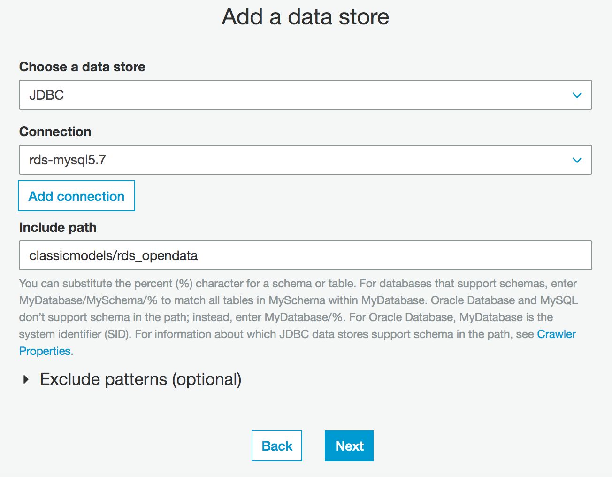

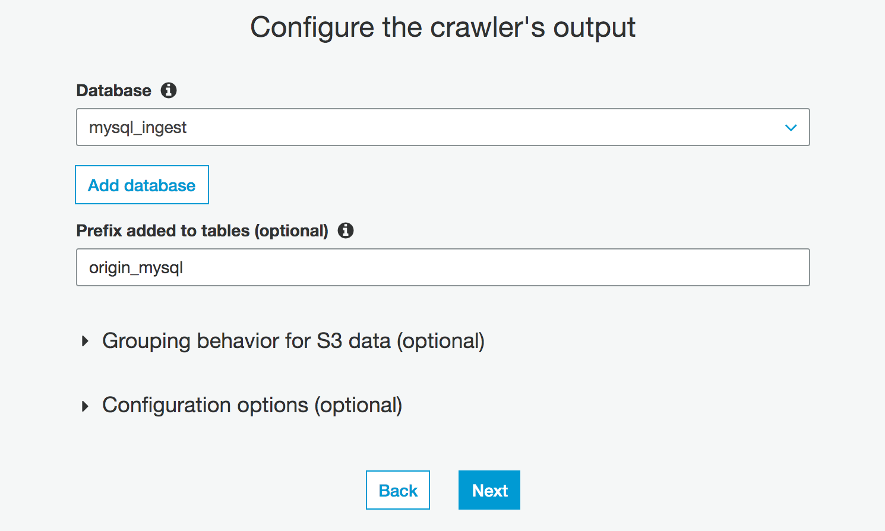

2. Run the crawler to generate the table schema and metadata in AWS Glue Data Catalog

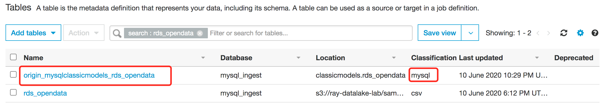

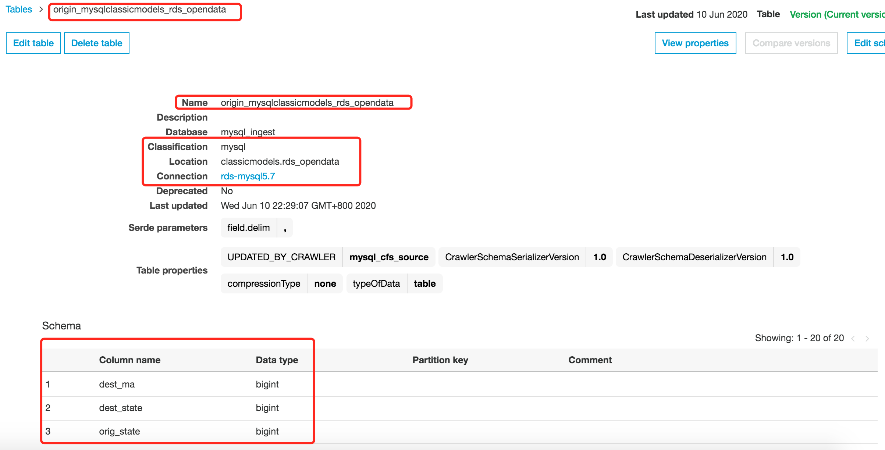

3. Create ETL job `cfs_full_mysql_to_s3_parquet`. 
```bash
1. Job name: cfs_full_mysql_to_s3_parquet.7
2. Choose a data source: table `origin_mysqlclassicmodels_rds_opendata` created by crawler
3. For the data target, choose Create tables in your data target. Then choose S3, and Format as Parquet
4. Leave the default data mappings, and finish creating the ETL job.
5. Optionally, partition data when writing to S3, you can edit the ETL script and add partitionKeys parameters 

datasink4 = glueContext.write_dynamic_frame.from_options(frame = dropnullfields3, connection_type = "s3", connection_options = {"path": "s3://xxxxx/applicationdata/mysql_ingest","partitionKeys": ["quarter"]}, format = "parquet", transformation_ctx = "datasink4")
```

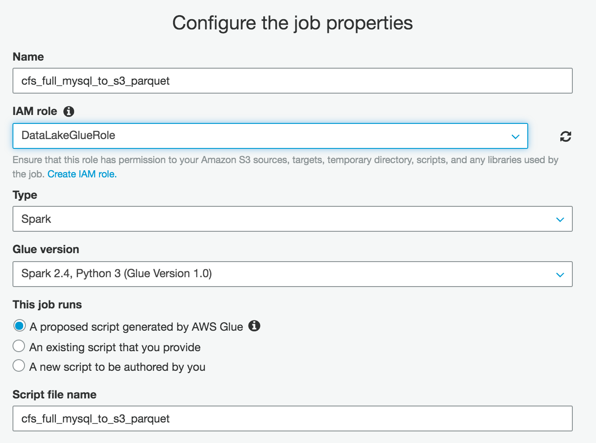

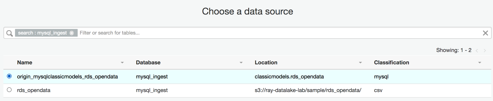

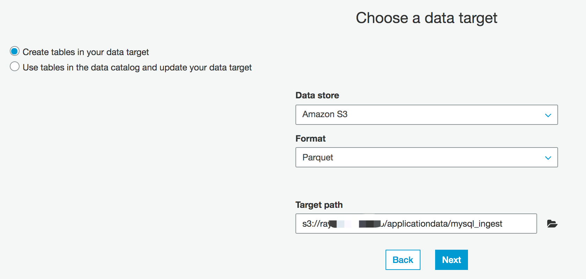

4. Run the ETL Job, verify the data created in S3
```bash
# Partitioned by each quarter of the year. 
aws s3 ls s3://xxxxx/applicationdata/mysql_ingest/ --region cn-northwest-1
                           PRE quarter=1/
                           PRE quarter=2/
                           PRE quarter=3/
                           PRE quarter=4/
aws s3 ls s3://xxxxx/applicationdata/mysql_ingest/quarter=1/ --region cn-northwest-1
2020-06-10 22:54:40    1573529 part-00000-1ba9003c-3562-4f3d-9d4f-8f82765ea2c4.c000.snappy.parquet
2020-06-10 22:54:40    1563694 part-00001-1ba9003c-3562-4f3d-9d4f-8f82765ea2c4.c000.snappy.parquet
2020-06-10 22:54:40    1571118 part-00002-1ba9003c-3562-4f3d-9d4f-8f82765ea2c4.c000.snappy.parquet
2020-06-10 22:54:40    1570223 part-00003-1ba9003c-3562-4f3d-9d4f-8f82765ea2c4.c000.snappy.parquet
....
```

5. Verify data in Athena
- Create and run a new crawler over the partitioned Parquet data in s3://xxxxx/applicationdata/mysql_ingest. 

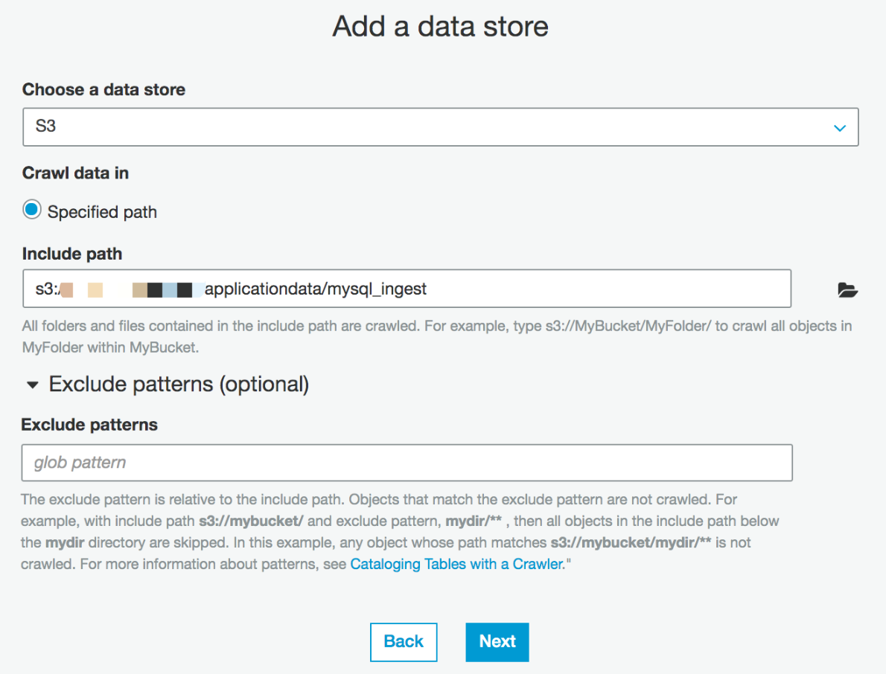

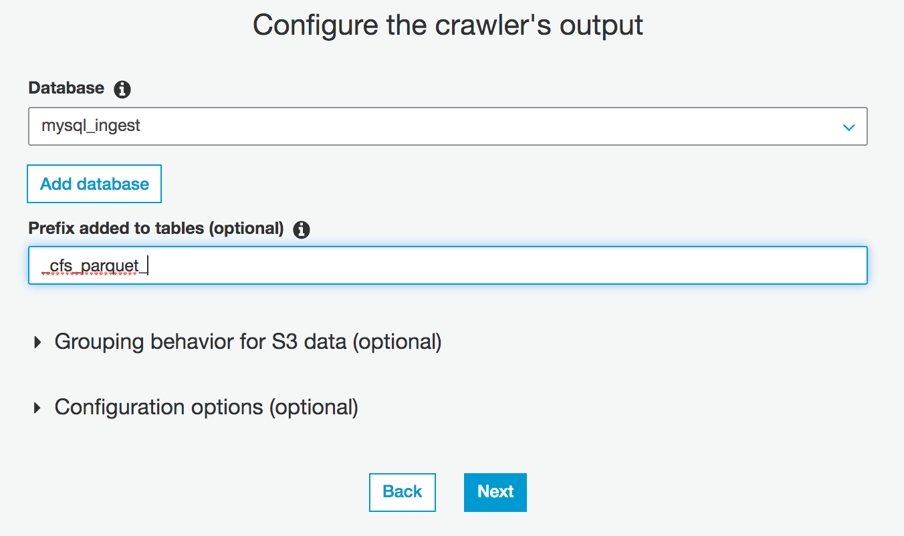

- The table generated by Crawler

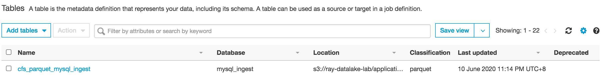

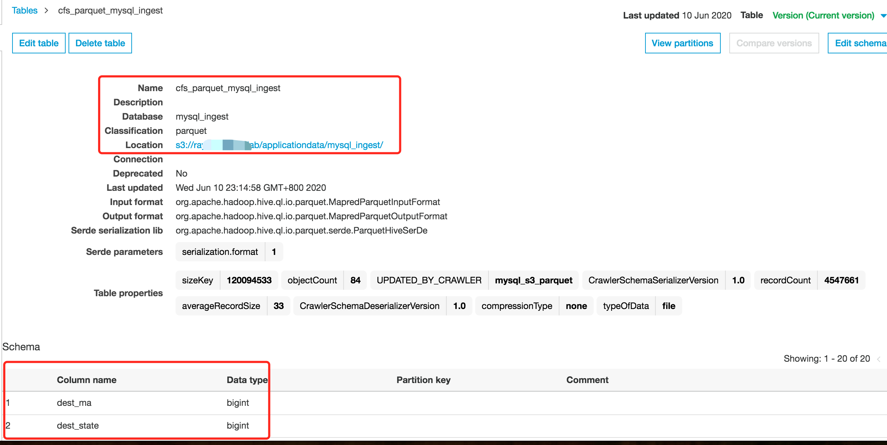

- Run an SQL query over the partitioned Parquet data in the Athena.

```bash
SELECT * FROM "mysql_ingest"."cfs_parquet_mysql_ingest" limit 10;

SELECT shipmt_id, orig_state, dest_state, quarter FROM "mysql_ingest"."cfs_parquet_mysql_ingest" WHERE quarter='2' ORDER BY shipmt_id limit 10;
```

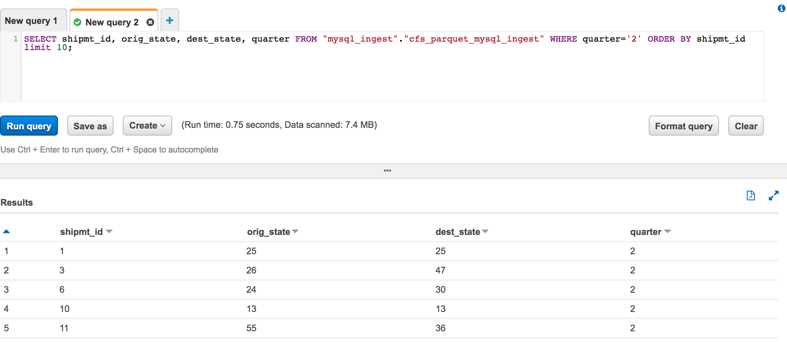

## Tuning for JDBC read parallelism (Optional)

In some cases, running an AWS Glue ETL job over a large database table results in out-of-memory (OOM) errors because all the data is read into a single executor. To avoid this situation, you can optimize the number of Apache Spark partitions and parallel JDBC connections that are opened during the job execution.

After crawling a database table, follow these steps to tune the parameters.

In the Data Catalog, edit the table and add the partitioning parameters `hashexpression` or `hashfield`. 

- hashexpression: If your database table contains a column with numeric values such as a unique ID or similar data, choose the column name for a parameter hashexpression. 
- hashfield: If no suitable numeric column is available, find a column containing string values with a good even distribution (high cardinality), and choose the column name for a parameter hashfield.
- hashpartitions: Provide a value of hashpartition as a number. By default, this value is set to 7. This parameter determines the number of Spark partitions and the resulting number of JDBC connections opened to the target database.

# Reference
[How to access and analyze on-premises data stores using AWS Glue](https://aws.amazon.com/blogs/big-data/how-to-access-and-analyze-on-premises-data-stores-using-aws-glue/)

