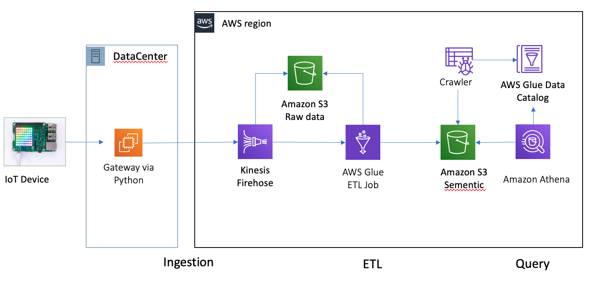
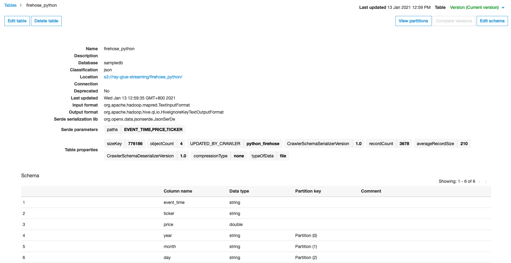
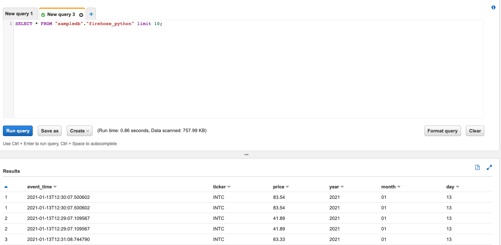

# Python Code send record to S3 via Kinesis Firehose

Architecture



1. Creating an Amazon Kinesis Data Firehose Delivery Stream
Follow up the [guide](https://docs.aws.amazon.com/firehose/latest/dev/basic-create.html). 

- Name your delivery stream `ExampleDeliveryStream`
- Source `Direct PUT or other sources`. 
- Destination `Amazon S3`
- S3 prefix: `firehose_python/year=!{timestamp:yyyy}/month=!{timestamp:MM}/day=!{timestamp:dd}/`
- S3 error prefix: `firehose_python/year=!{timestamp:yyyy}/month=!{timestamp:MM}/day=!{timestamp:dd}/!{firehose:error-output-type}`
- Buffer size: `5M`
- Buffer interval: `60s`

    When you create the Kinesis Data Firehose delivery stream, also create the delivery stream's  and `IAM role`. 

2. Generate Data via Python Firehose SDK [stock-firehose.py](scripts/stock-firehose.py)
```bash
python stock-firehose.py
```

3. Using Glue Crawler to discovery the schema and setup data catalog


4. Query data from Athena


# Reference
[Python Firehose SDK](https://boto3.amazonaws.com/v1/documentation/api/latest/reference/services/firehose.html)

[Firehose PutRecord](https://docs.aws.amazon.com/firehose/latest/APIReference/API_PutRecord.html)