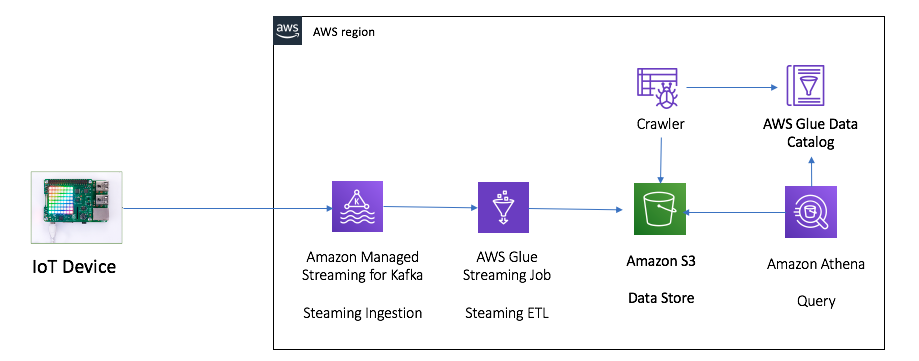
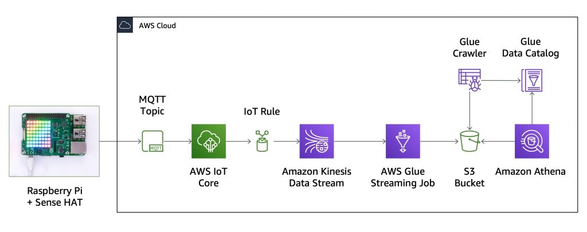
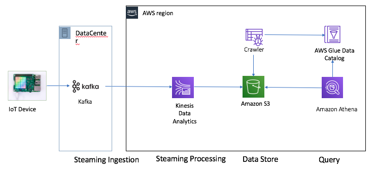
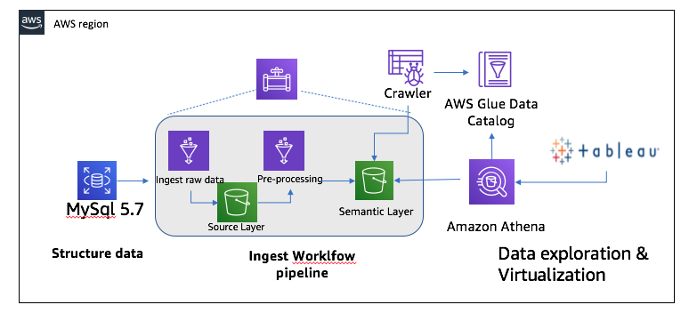

# AWS serverless etl and streaming demo

## Glue Streaming ETL Demo
This demo is shown how to use the Glue Streaming feature to Manage continuous ingestion pipelines and processing data on-the-fly. The Glue Steaming Jobs is extending AWS Glue jobs, based on Apache Spark, to run continuously and consume data from streaming platforms such as Amazon Kinesis Data Streams and Apache Kafka (including the fully-managed Amazon MSK).

Glue can provision, manage, and scale the infrastructure to ingest data to data lakes on Amazon S3, data warehouses such as Amazon Redshift, or store streaming data in a DynamoDB table for quick lookups, or in Elasticsearch to look for specific operation patterns.

Glue Streaming is based on Spark Structured Streaming to implement data transformations, such as aggregating, partitioning, and formatting as well as joining with other data sets to enrich or cleanse the data for easier analysis. 

Please find more details in [Adding Streaming ETL Jobs in AWS Glue guide](https://docs.aws.amazon.com/glue/latest/dg/add-job-streaming.html)

[IoT-Kafka-GlueStreaming-Demo](IoT-Kafka-GlueStreaming-Demo.md)

[IoT-Kinesis-GlueStreaming-Demo](IoT-Kinesis-GlueStreaming-Demo.md)

[kinesis-kafka-connector-Demo](Kafka-to-Kinesis-Connector.md)

## Kinesis Data Anlytics Streaming Demo

This demo is shown how to use the Kinesis Data Anlytics to Manage continuous ingestion pipelines and processing data on-the-fly. Kinesis Data Anlytics can help you run continuously and consume data from streaming platforms such as Amazon Kinesis Data Streams and Apache Kafka (including the fully-managed Amazon MSK).

[IoT-Kinesis-KinesisDataAnlytics-Demo](IoT-Kinesis-KinesisDataAnlytics-Demo.md)

[IoT-Kafka-KinesisDataAnlytics-Demo](IoT-Kafka-KinesisDataAnlytics-Demo.md)

## Glue ingest the RDS data

This demo is shown how to use the Glue to ingest data from RDS database.

Architeture

[Glue ingest MySQL5.7 via Glue connector](MySQL5.7-Glue-Demo.md)

[Glue ingest MySQL8.0 via Glue connector](MySQL8.0-Glue-Demo.md)

## Data-On-Boarding-End2End-Demo

[Data On Boarding End2End Demo](Data-On-Boarding-End2End-Demo.md)

## Python Code send record to S3 via Kinesis Firehose

[Pyhton-Send-Data-Firefose Demo](Pyhton-Send-Data-Firefose.md)