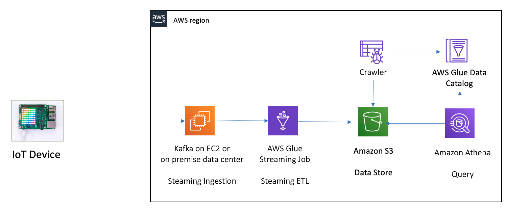
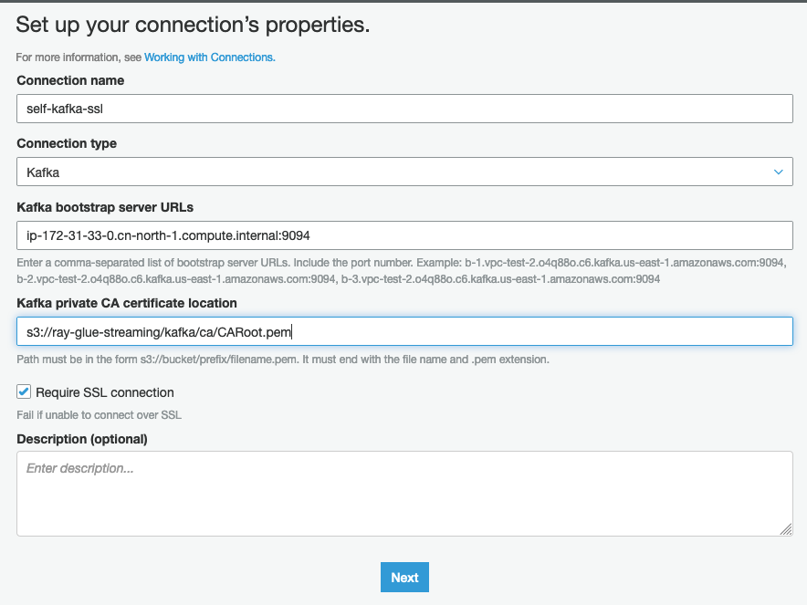
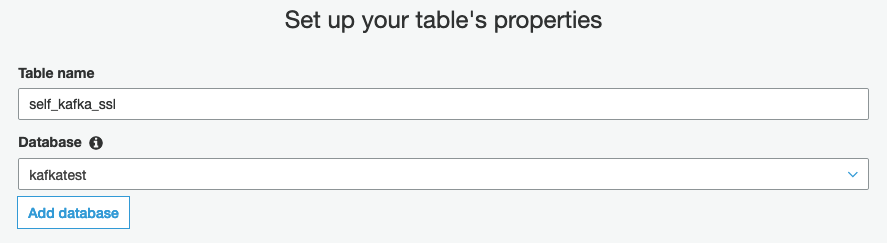
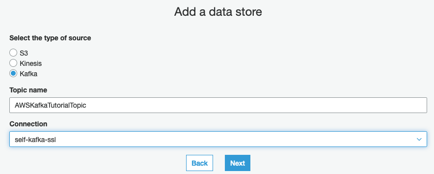
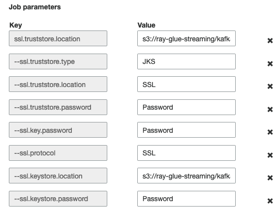
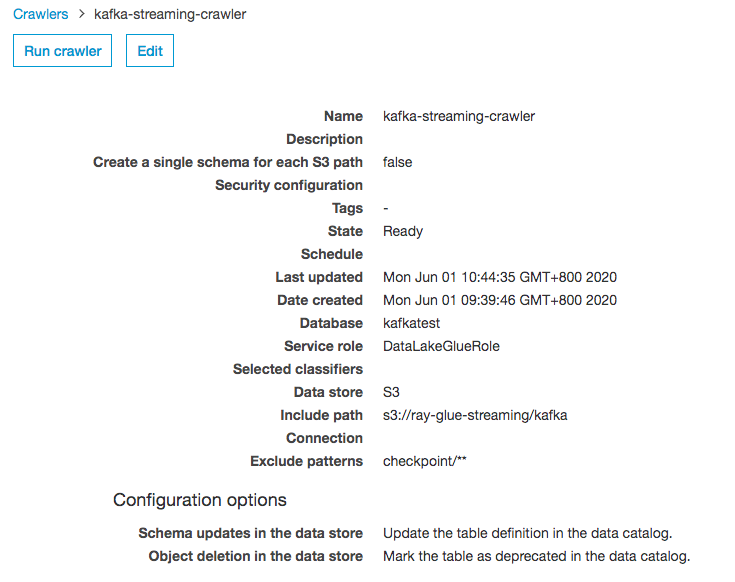
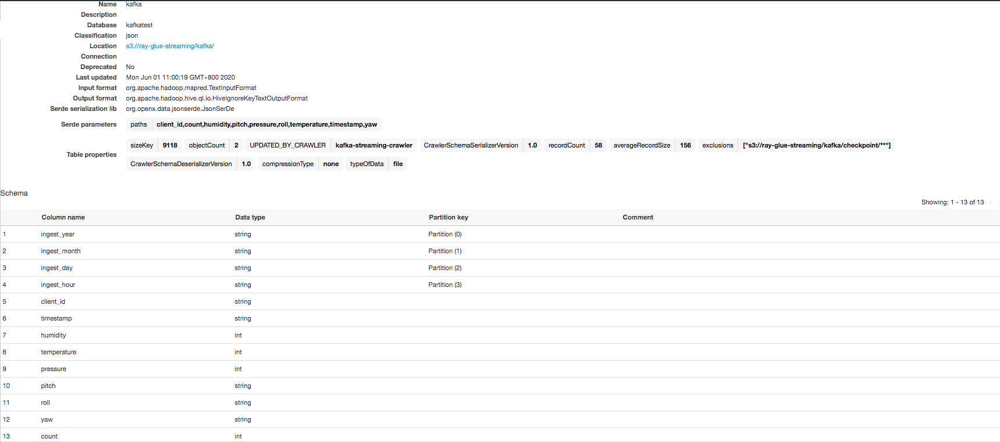
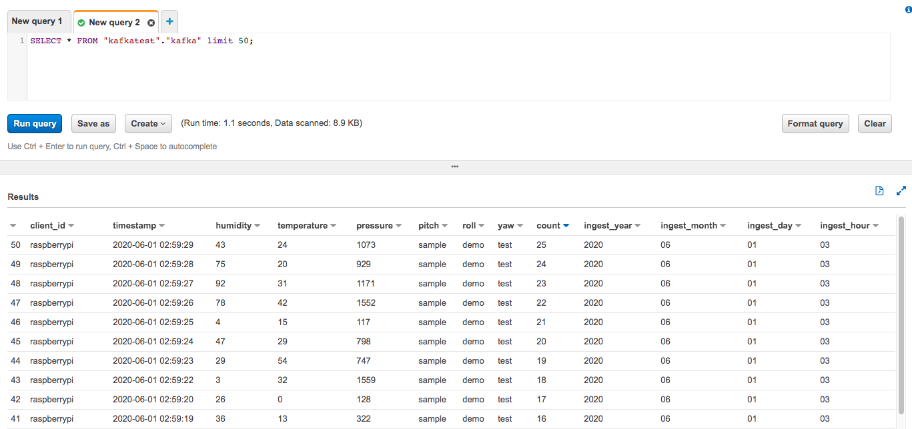

# self-managed-kafka-glue-streaming-demo

## IoT - Self-managed Kafka - Glue Streaming - Athena demo



# Create Security group

1. Security group `kafka-sg` and ingress rule

   - Protocol: TCP port 2181 from all sources
   - Protocol: TCP port 9092 from all sources
   - Protocol: TCP port 9094 from all sources
   - Protocol: TCP ports 2888–3888 from all sources
   - All traffic to `kafka-sg` security group or VPC CIDR range

2. Create EC2 instance

   - AMI: Ubuntu Server 18.04 LTS (HVM)
   - Name: KafkaServer
   - Instance Type: m5.large
   - Storage: 100GiB
   - Security Group: `kafka-sg`

3. Create Kafka 2.3.1 on EC2

```bash
sudo su - ubuntu

# installing Java 1.8
sudo apt update
sudo apt install openjdk-8-jdk
java -version

# install Kafka
wget http://www-us.apache.org/dist/kafka/2.3.1/kafka_2.12-2.3.1.tgz
tar xzf kafka_2.12-2.3.1.tgz
ln -s kafka_2.12-2.3.1 kafka

# Configure and start Zookeeper
cd kafka
mkdir /tmp/zookeeper
touch /tmp/zookeeper/myid
echo "1" >> /tmp/zookeeper/myid

# edit the config/zookeeper.properties file
initLimit=5
syncLimit=2
tickTime=2000
# list of servers: <ip>:2888:3888
server.1=0.0.0.0:2888:3888

# start Zookeeper
bin/zookeeper-server-start.sh config/zookeeper.properties

# Configure and start Kafka
# edit the config/server.properties
broker.id=1
zookeeper.connect=0.0.0.0:2181
listeners=PLAINTEXT://:9092,SSL://:9094
advertised.listeners=PLAINTEXT://your-host-name:9092,SSL://your-host-name:9094

# Start Kafka
bin/kafka-server-start.sh config/server.properties
```

4. Configuring and publishing to a topic

- SSH to Client Server

```bash
sudo yum install java-1.8.0
java -version
wget http://www-us.apache.org/dist/kafka/2.3.1/kafka_2.12-2.3.1.tgz
tar xzf kafka_2.12-2.3.1.tgz
ln -s kafka_2.12-2.3.1 kafka

ZookeeperConnectString=ip-172-31-33-0.cn-north-1.compute.internal

# replacing ZookeeperConnectString with the value that after you ran the describe-cluster command.
bin/kafka-topics.sh --create --zookeeper $ZookeeperConnectString --replication-factor 1 --partitions 1 --topic AWSKafkaTutorialTopic
Created topic AWSKafkaTutorialTopic.
```

3. Produce and consume data, verify the data can be produced and consumed correctly

```bash
cd kafka/

# Set BootstrapBroker plaintext and BootstrapBroker TLS
BootstrapBrokerString=ip-172-31-33-0.cn-north-1.compute.internal:9092

# Producer
bin/kafka-console-producer.sh --broker-list $BootstrapBrokerString --topic AWSKafkaTutorialTopic

# Consumer
bin/kafka-console-consumer.sh --bootstrap-server $BootstrapBrokerString --topic AWSKafkaTutorialTopic --from-beginning
```

4. Python producer code

```bash
# Install dependency
pip install -r scripts/requirements.txt --user

# Run code to send, once per second, a JSON message with sensor data to the `AWSKafkaTutorialTopic` Kafka topic.
python scripts/iot-kafka-producer.py

# Check the consumer terminal can get the message
bin/kafka-console-consumer.sh --bootstrap-server $BootstrapBrokerString --consumer.config config/client.properties --topic AWSKafkaTutorialTopic --from-beginning
```

## Enable SSL encryption

1. Create Keystore and Truststore

```bash
# Generate the keys and certificates
keytool -keystore kafka.server.keystore.jks -alias localhost -keyalg RSA -validity 365 -genkey
keytool -list -v -keystore kafka.server.keystore.jks
# Create your own Certificate Authority (CA)
openssl req -new -x509 -keyout ca-key -out ca-cert -days 365
# Sign the certificate
keytool -keystore kafka.client.truststore.jks -alias CARoot -importcert -file ca-cert
keytool -keystore kafka.server.truststore.jks -alias CARoot -importcert -file ca-cert
keytool -keystore kafka.server.keystore.jks -alias localhost -certreq -file cert-file
openssl x509 -req -CA ca-cert -CAkey ca-key -in cert-file -out cert-signed -days 365 -CAcreateserial
keytool -keystore kafka.server.keystore.jks -alias CARoot -importcert -file ca-cert
keytool -keystore kafka.server.keystore.jks -alias localhost -importcert -file cert-signed

# Copy the keystore and truststore
mkdir -p /home/ubuntu/kafka/ssl/private/
mv kafka.server.keystore.jks /home/ubuntu/kafka/ssl/private/kafka.server.keystore.jks
mv kafka.server.truststore.jks /home/ubuntu/kafka/ssl/private/kafka.server.truststore.jks

# Copy the kafka.client.truststore.jks to your client
scp ubuntu@172.31.33.0:/home/ubuntu/kafka/ssl/private/kafka.client.truststore.jks kafka.client.truststore.jks
scp ubuntu@172.31.33.0:/home/ubuntu/kafka/ssl/private/kafka.client.keystore.jks kafka.client.keystore.jks
```

2. Configure Brokers

```bash

# add the following to server.properties

############################ SSL #####################################

ssl.keystore.location=/home/ubuntu/kafka/ssl/private/kafka.server.keystore.jks
ssl.keystore.password=Password
ssl.truststore.location=/home/ubuntu/kafka/ssl/private/kafka.server.truststore.jks
ssl.truststore.password=Password
ssl.client.auth=none
ssl.endpoint.identification.algorithm=
ssl.enabled.protocols=TLSv1.2,TLSv1.1,TLSv1
allow.everyone.if.no.acl.found=true
ssl.keystore.type=JKS
ssl.truststore.type=JKS
```

3. Configure Clients
```bash

keytool -keystore kafka.client.keystore.jks -alias localhost -keyalg RSA -validity 365 -genkey
keytool -list -v -keystore kafka.client.keystore.jks
# Sign the certificate
keytool -keystore kafka.client.keystore.jks -alias localhost -certreq -file cert-file-client
openssl x509 -req -CA ca-cert -CAkey ca-key -in cert-file-client -out cert-signed-client -days 365 -CAcreateserial
keytool -keystore kafka.client.keystore.jks -alias CARoot -importcert -file ca-cert
keytool -keystore kafka.client.keystore.jks -alias localhost -importcert -file cert-signed-client

cd kafka/
# Edit config/client.properties
# If client authentication is not required by the broker, the following is a minimal configuration
ssl.protocol=SSL
security.protocol=SSL
ssl.endpoint.identification.algorithm=
ssl.truststore.location=/home/ec2-user/kafka/ssl/private/kafka.client.truststore.jks
ssl.truststore.password=Password
# If client authentication is required, then a keystore must be created for each client
ssl.keystore.location =/home/ec2-user/kafka/ssl/private/kafka.client.keystore.jks
ssl.keystore.password =Password
ssl.key.password =Password
ssl.keystore.type=JKS
ssl.truststore.type=JKS
```

4. Test Producer and Consumer
```bash
BootstrapBrokerStringTLS=ip-172-31-33-0.cn-north-1.compute.internal:9094
# Provider
bin/kafka-console-producer.sh --broker-list $BootstrapBrokerStringTLS --producer.config config/client.properties --topic AWSKafkaTutorialTopic

# Consumer
bin/kafka-console-consumer.sh --bootstrap-server $BootstrapBrokerStringTLS --consumer.config config/client.properties --topic AWSKafkaTutorialTopic --from-beginning
```

## Connect to Apache Kafka from Python using SSL
1. Extract the keys
```bash
## overview of kafka.client.keystore.jks content
keytool -list -rfc -keystore kafka.client.keystore.jks
## extract the client certificate
keytool -exportcert -alias localhost -keystore kafka.client.keystore.jks \
        -rfc -file certificate.pem
## extract the clients key
keytool -v -importkeystore -srckeystore kafka.client.keystore.jks \
        -srcalias localhost -destkeystore cert_and_key.p12 -deststoretype PKCS12
openssl pkcs12 -in cert_and_key.p12 -nocerts -nodes
## The second command only prints the key to STDOUT. From there it can be copied and pasted into ‘key.pem’. Make sure to copy the lines inclusive between —–BEGIN PRIVATE KEY—– and —–END PRIVATE KEY—–. 

## Finally we will extract the CARoot certificate
keytool -exportcert -alias CARoot -keystore kafka.client.keystore.jks -rfc \
        -file CARoot.pem
```

2. Edit Python code
```python
from kafka import KafkaConsumer, KafkaProducer

consumer = KafkaConsumer(bootstrap_servers='my.server.com',
                          security_protocol='SSL',
                          ssl_check_hostname=True,
                          ssl_cafile='CARoot.pem',
                          ssl_certfile='certificate.pem',
                          ssl_keyfile='key.pem')

producer = KafkaProducer(bootstrap_servers='my.server.com',
                          security_protocol='SSL',
                          ssl_check_hostname=True,
                          ssl_cafile='CARoot.pem',
                          ssl_certfile='certificate.pem',
                          ssl_keyfile='key.pem')
```

3. Test python code
```bash
python scripts/iot-kafka-producer-ssl.py

# Consumer
bin/kafka-console-consumer.sh --bootstrap-server $BootstrapBrokerStringTLS --consumer.config config/client.properties --topic AWSKafkaTutorialTopic --from-beginning
```

# Processing Streaming Data with AWS Glue

1. Creating an AWS Glue Connection for an Apache Kafka Data Stream

- Click “Add connection”, input the Connection Name as `self-kafka-ssl`, Connection type for Kafka, Kafka bootstrap server URLs you get it from Kafka cluster `$BootstrapBrokerStringTLS`
- Select Require SSL connection, and set Kafka private CA certificate location

  

- Choose the VPC, Subnet with the same as Kafka Server. The security group `kafka-sg`


2. Creating a Data Catalog Table for a Streaming Source
- Navigate to Glue console
- Click `Database` and `Add database`, to create a new database `kafkatest`.
- Click `Tables` and `Add table manully`, to add a new table `self_kafka_ssl` 

- Kafka connection `self-kafka-ssl` with topic `AWSKafkaTutorialTopic`

- Format: json
- Table schema

```json
self_kafka_ssl = {
            "client_id": string
            "timestamp": timestamp,
            "humidity": int,
            "temperature": int,
            "pressure": int,
            "pitch": string,
            "roll": string,
            "yaw": string,
            "count": bigint
        }
```

3. Create Glue Streaming ETL job.

Create a new job to ingest data from Kafka, and store the data into S3.

- The IAM role with `AWSGlueServiceRole` and `AmazonMSKReadOnlyAccess` managed policies.
- Create Glue Streaming job with name `self-kafka-ssl-streaming`
- Select the type as `Spark Streaming` and Glue version `Spark2.4, Python 3 (Glue Version 1.0`
- Set below properties
```bash
# If client authentication is not required by the broker, the following is a minimal configuration
ssl.protocol=SSL
security.protocol=SSL
ssl.endpoint.identification.algorithm=
ssl.truststore.location=s3://ray-glue-streaming/kafka/ca/kafka.client.truststore.jks
ssl.truststore.password=Password
# If client authentication is required, then a keystore must be created for each client
ssl.keystore.location =s3://ray-glue-streaming/kafka/ca/kafka.client.keystore.jks
ssl.keystore.password =Password
ssl.key.password =Password
ssl.keystore.type=JKS
ssl.truststore.type=JKS
```

- For the data source, select the table `self_kafka_ssl` as just created, receiving data from the Kafka stream.
- As target, create a new table in the Glue Data Catalog, using `JSON` format. The JSON files generated by this job are going to be stored in an S3 bucket `s3://ray-glue-streaming/kafka/self_kafka_ssl/`
- Leave the default mapping that keeps in output all the columns in the source stream.
- Click Save job and edit scripts, you will see the scripts generated automatically. You can add your processing logic, or update the currently code. If you update the code, please click Save.
- Start the job, and after a few minutes, you can see the checkpoint information and the ingested data partitioned. They are partitioned by ingest date (year, month, day, and hour).
- Check the cloudwatch logs

You will see the job history from below, and you can click the “Logs” or “Error logs” to see the detailed information.
```bash
CONNECTION_NAMES = self-kafka-ssl
Downloading cacert for connection "self-kafka-ssl"
Downloading s3 file from s3://ray-glue-streaming/kafka/ca/CARoot.pem to local with filename as: custom_ca_cert.pem
Completed 1.4 KiB/1.4 KiB (6.3 KiB/s) with 1 file(s) remaining
download: s3://ray-glue-streaming/kafka/ca/CARoot.pem to ./custom_ca_cert.pem
Importing downloaded ca cert file into TrustStore

Certificate was added to keystore
Enter keystore password:  
```


3. Configure Crawler `kafka-streaming-crawler` to populate the Glue Data Catalog with target S3 tables `iot_sensor_kinesis`

In the crawler configuration, exclude the `checkpoint/**` folder used by Glue to keep track of the data that has been processed.



After the crawler execution complete, you can check the table schema. They are partitioned by ingest date (year, month, day, and hour)



# Query the data from Athena

```bash
SELECT * FROM "kafkatest"."kafka" limit 50;

Select count(*) from "kafkatest"."kafka";
```




# Reference
[AWS Glue supports reading from self-managed Apache Kafka ](https://docs.aws.amazon.com/glue/latest/dg/add-job-streaming.html)

[Connect to Apache Kafka Data in AWS Glue Jobs Using CData JDBC](https://www.cdata.com/kb/tech/kafka-jdbc-aws-glue.rst)

[Using self-hosted Apache Kafka as an event source for AWS Lambda](https://aws.amazon.com/blogs/compute/using-self-hosted-apache-kafka-as-an-event-source-for-aws-lambda/)

[Encryption and Authentication with SSL](https://docs.confluent.io/2.0.0/kafka/ssl.html#encryption-and-authentication-using-ssl)

[Encryption and Authentication with SSL - current version](https://docs.confluent.io/platform/current/kafka/authentication_ssl.html)

[kafka python KafkaProducer](https://kafka-python.readthedocs.io/en/master/apidoc/KafkaProducer.html)

[Connect to Apache Kafka from Python using SSL](http://maximilianchrist.com/python/databases/2016/08/13/connect-to-apache-kafka-from-python-using-ssl.html)
