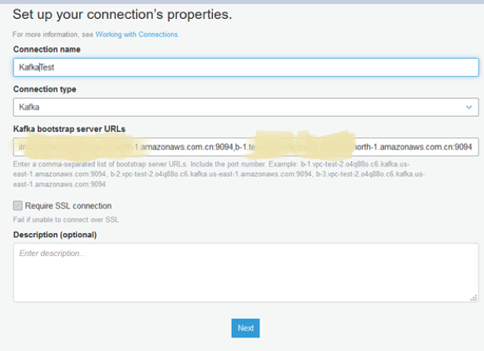
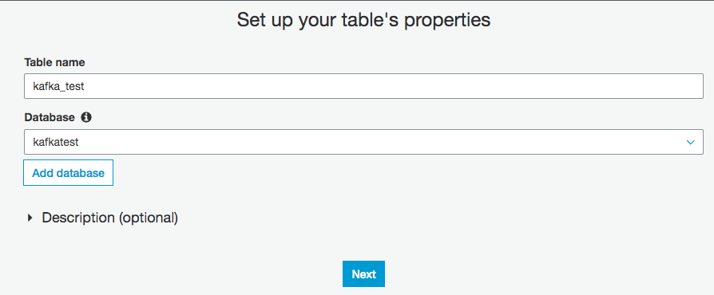
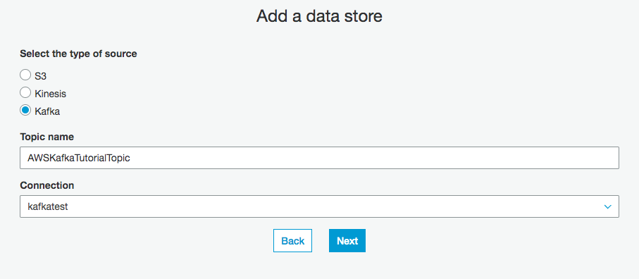
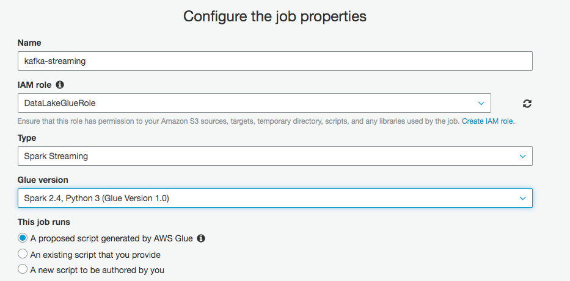
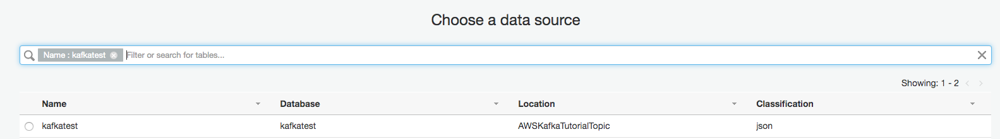
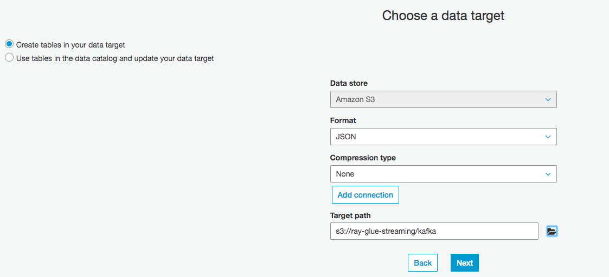
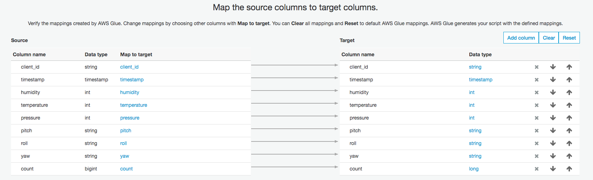
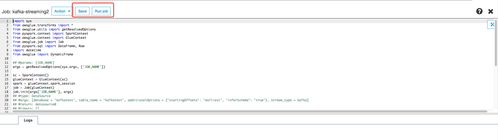
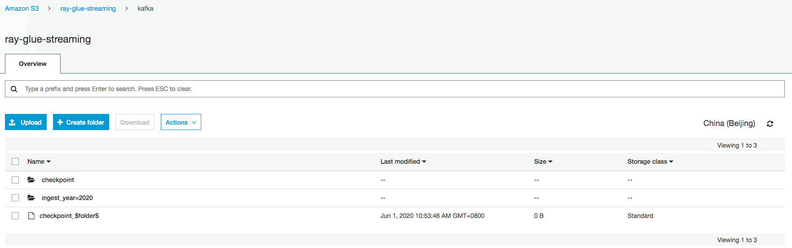

# self-managed-kafka-glue-streaming-demo

## IoT - Self-managed Kafka - Glue Streaming - Athena demo


# Create Security group

1. Security group `kafka-sg` and ingress rule

   - Protocol: TCP port 2181 from all sources
   - Protocol: TCP port 9092 from all sources
   - Protocol: TCP port 9094 from all sources
   - Protocol: TCP ports 2888–3888 from all sources
   - All traffic to `kafka-sg` security group or VPC CIDR range

2. Create EC2 instance

   - AMI: Ubuntu Server 18.04 LTS (HVM)
   - Name: KafkaServer
   - Instance Type: m5.large
   - Storage: 100GiB
   - Security Group: `kafka-sg`

3. Create Kafka 2.3.1 on EC2

```bash
sudo su - ubuntu

# installing Java 1.8
sudo apt update
sudo apt install openjdk-8-jdk
java -version

# install Kafka
wget http://www-us.apache.org/dist/kafka/2.3.1/kafka_2.12-2.3.1.tgz
tar xzf kafka_2.12-2.3.1.tgz
ln -s kafka_2.12-2.3.1 kafka

# Configure and start Zookeeper
cd kafka
mkdir /tmp/zookeeper
touch /tmp/zookeeper/myid
echo "1" >> /tmp/zookeeper/myid

# edit the config/zookeeper.properties file
initLimit=5
syncLimit=2
tickTime=2000
# list of servers: <ip>:2888:3888
server.1=0.0.0.0:2888:3888

# start Zookeeper
bin/zookeeper-server-start.sh config/zookeeper.properties

# Configure and start Kafka
# edit the config/server.properties
broker.id=1
zookeeper.connect=0.0.0.0:2181
listeners=PLAINTEXT://:9092,SSL://:9094
advertised.listeners=PLAINTEXT://your-host-name:9092,SSL://your-host-name:9094

# Start Kafka
bin/kafka-server-start.sh config/server.properties
```

4. Configuring and publishing to a topic

- SSH to Client Server

```bash
sudo yum install java-1.8.0
java -version
wget http://www-us.apache.org/dist/kafka/2.3.1/kafka_2.12-2.3.1.tgz
tar xzf kafka_2.12-2.3.1.tgz
ln -s kafka_2.12-2.3.1 kafka

ZookeeperConnectString=ip-172-31-33-0.cn-north-1.compute.internal

# replacing ZookeeperConnectString with the value that after you ran the describe-cluster command.
bin/kafka-topics.sh --create --zookeeper $ZookeeperConnectString --replication-factor 1 --partitions 1 --topic AWSKafkaTutorialTopic
Created topic AWSKafkaTutorialTopic.
```

3. Produce and consume data, verify the data can be produced and consumed correctly

```bash
cd kafka/

# Set BootstrapBroker plaintext and BootstrapBroker TLS
BootstrapBrokerString=ip-172-31-33-0.cn-north-1.compute.internal:9092

# Producer
bin/kafka-console-producer.sh --broker-list $BootstrapBrokerString --topic AWSKafkaTutorialTopic

# Consumer
bin/kafka-console-consumer.sh --bootstrap-server $BootstrapBrokerString --topic AWSKafkaTutorialTopic --from-beginning
```

4. Python producer code

```bash
# Install dependency
pip install -r scripts/requirements.txt --user

# Run code to send, once per second, a JSON message with sensor data to the `AWSKafkaTutorialTopic` Kafka topic.
python scripts/iot-kafka-producer.py

# Check the consumer terminal can get the message
bin/kafka-console-consumer.sh --bootstrap-server $BootstrapBrokerString --consumer.config config/client.properties --topic AWSKafkaTutorialTopic --from-beginning
```

## Enable SSL encryption

1. Create Keystore and Truststore

```bash
# Generate the keys and certificates
keytool -keystore kafka.server.keystore.jks -alias localhost -keyalg RSA -validity 365 -genkey
keytool -list -v -keystore kafka.server.keystore.jks
# Create your own Certificate Authority (CA)
openssl req -new -x509 -keyout ca-key -out ca-cert -days 365
# Sign the certificate
keytool -keystore kafka.client.truststore.jks -alias CARoot -importcert -file ca-cert
keytool -keystore kafka.server.truststore.jks -alias CARoot -importcert -file ca-cert
keytool -keystore kafka.server.keystore.jks -alias localhost -certreq -file cert-file
openssl x509 -req -CA ca-cert -CAkey ca-key -in cert-file -out cert-signed -days 365 -CAcreateserial
keytool -keystore kafka.server.keystore.jks -alias CARoot -importcert -file ca-cert
keytool -keystore kafka.server.keystore.jks -alias localhost -importcert -file cert-signed

# Copy the keystore and truststore
mkdir -p /home/ubuntu/kafka/ssl/private/
mv kafka.server.keystore.jks /home/ubuntu/kafka/ssl/private/kafka.server.keystore.jks
mv kafka.server.truststore.jks /home/ubuntu/kafka/ssl/private/kafka.server.truststore.jks

# Copy the kafka.client.truststore.jks to your client
scp ubuntu@172.31.33.0:/home/ubuntu/kafka/ssl/private/kafka.client.truststore.jks kafka.client.truststore.jks
scp ubuntu@172.31.33.0:/home/ubuntu/kafka/ssl/private/kafka.client.keystore.jks kafka.client.keystore.jks
```

2. Configure Brokers

```bash

# add the following to server.properties

############################ SSL #####################################

ssl.keystore.location=/home/ubuntu/kafka/ssl/private/kafka.server.keystore.jks
ssl.keystore.password=Password
ssl.truststore.location=/home/ubuntu/kafka/ssl/private/kafka.server.truststore.jks
ssl.truststore.password=Password
ssl.client.auth=none
ssl.endpoint.identification.algorithm=
ssl.enabled.protocols=TLSv1.2,TLSv1.1,TLSv1
allow.everyone.if.no.acl.found=true
ssl.keystore.type=JKS
ssl.truststore.type=JKS
```

3. Configure Clients
```bash

keytool -keystore kafka.client.keystore.jks -alias localhost -keyalg RSA -validity 365 -genkey
keytool -list -v -keystore kafka.client.keystore.jks
# Sign the certificate
keytool -keystore kafka.client.keystore.jks -alias localhost -certreq -file cert-file-client
openssl x509 -req -CA ca-cert -CAkey ca-key -in cert-file-client -out cert-signed-client -days 365 -CAcreateserial
keytool -keystore kafka.client.keystore.jks -alias CARoot -importcert -file ca-cert
keytool -keystore kafka.client.keystore.jks -alias localhost -importcert -file cert-signed-client

cd kafka/
# Edit config/client.properties
# If client authentication is not required by the broker, the following is a minimal configuration
ssl.protocol=SSL
security.protocol=SSL
ssl.endpoint.identification.algorithm=
ssl.truststore.location=/home/ec2-user/kafka/ssl/private/kafka.client.truststore.jks
ssl.truststore.password=Password
# If client authentication is required, then a keystore must be created for each client
ssl.keystore.location =/home/ec2-user/kafka/ssl/private/kafka.client.keystore.jks
ssl.keystore.password =Password
ssl.key.password =Password
ssl.keystore.type=JKS
ssl.truststore.type=JKS
```

4. Test Producer and Consumer
```bash
BootstrapBrokerStringTLS=ip-172-31-33-0.cn-north-1.compute.internal:9094
# Provider
bin/kafka-console-producer.sh --broker-list $BootstrapBrokerStringTLS --producer.config config/client.properties --topic AWSKafkaTutorialTopic

# Consumer
bin/kafka-console-consumer.sh --bootstrap-server $BootstrapBrokerStringTLS --consumer.config config/client.properties --topic AWSKafkaTutorialTopic --from-beginning
```

## Connect to Apache Kafka from Python using SSL
1. Extract the keys
```bash
## overview of kafka.client.keystore.jks content
keytool -list -rfc -keystore kafka.client.keystore.jks
## extract the client certificate
keytool -exportcert -alias localhost -keystore kafka.client.keystore.jks \
        -rfc -file certificate.pem
## extract the clients key
keytool -v -importkeystore -srckeystore kafka.client.keystore.jks \
        -srcalias localhost -destkeystore cert_and_key.p12 -deststoretype PKCS12
openssl pkcs12 -in cert_and_key.p12 -nocerts -nodes
## The second command only prints the key to STDOUT. From there it can be copied and pasted into ‘key.pem’. Make sure to copy the lines inclusive between —–BEGIN PRIVATE KEY—– and —–END PRIVATE KEY—–. 

## Finally we will extract the CARoot certificate
keytool -exportcert -alias CARoot -keystore kafka.client.keystore.jks -rfc \
        -file CARoot.pem
```

2. Edit Python code
```python
from kafka import KafkaConsumer, KafkaProducer

consumer = KafkaConsumer(bootstrap_servers='my.server.com',
                          security_protocol='SSL',
                          ssl_check_hostname=True,
                          ssl_cafile='CARoot.pem',
                          ssl_certfile='certificate.pem',
                          ssl_keyfile='key.pem')

producer = KafkaProducer(bootstrap_servers='my.server.com',
                          security_protocol='SSL',
                          ssl_check_hostname=True,
                          ssl_cafile='CARoot.pem',
                          ssl_certfile='certificate.pem',
                          ssl_keyfile='key.pem')
```

3. Test python code
```bash
python scripts/iot-kafka-producer-ssl.py

# Consumer
bin/kafka-console-consumer.sh --bootstrap-server $BootstrapBrokerStringTLS --consumer.config config/client.properties --topic AWSKafkaTutorialTopic --from-beginning
```


# Processing Streaming Data with AWS Glue

1. Create Kafka connection for AWS Glue

- Click “Add connection”, input the Connection Name as `kafkatest`, Connection type for Kafka, Kafka bootstrap server URLs you get it from Kafka cluster `$BootstrapBrokerStringTLS`
- Connection for Kafka by default use the SSL connection, you CAN NOT use the Kafka bootstrap server URLs without TLS

  

- Choose the VPC, Subnet and security group. The security group need open all ingress ports for same security group or VPC CIDR range

  Otherwise the Glue job will failed with error

  ```bash
  JobName:kafka-streaming and JobRunId:jr_1dc5fbc66da7 failed to execute with exception At least one security group must open all ingress ports.
  To limit traffic, the source security group in your inbound rule can be restricted to the same security group
  ```

2. I manually add a table in the Glue Data Catalog.

- Click Database and Add database, to create a new database `kafkatest`.
  
- Click Tables and Add tables, to add a new table `kafkatest` from Kafka connection with topic `AWSKafkaTutorialTopic`
  
- Format: json
- Table schema

```json
kafkatest = {
            "client_id": string
            "timestamp": timestamp,
            "humidity": int,
            "temperature": int,
            "pressure": int,
            "pitch": string,
            "roll": string,
            "yaw": string,
            "count": bigint
        }
```

3. Create Glue Streaming ETL job.

   Create a new job to ingest data from Kafka, and store the data into S3.

- The IAM role with `AWSGlueServiceRole` and `AmazonMSKReadOnlyAccess` managed policies.
- Create Glue Streaming job with name `kafka-streaming`
  - Select the type as `Spark Streaming` and Glue version `Spark2.4, Python 3`
    
  - For the data source, select the table `kafkatest` as just created, receiving data from the Kafka stream.
    
  - As target, create a new table in the Glue Data Catalog, using `JSON` format. The JSON files generated by this job are going to be stored in an S3 bucket
    
  - Leave the default mapping that keeps in output all the columns in the source stream.
    
  - Click Save job and edit scripts, you will see the scripts generated automatically. You can add your processing logic, or update the currently code. If you update the code, please click Save.
    
- Start the job, and after a few minutes, you can see the checkpoint information and the ingested data partitioned. They are partitioned by ingest date (year, month, day, and hour).
  
- Check the cloudwatch logs

You will see the job history from below, and you can click the “Logs” or “Error logs” to see the detailed information.

SSL/TLS connection

```bash
consumer.ConsumerConfig (AbstractConfig.java:logAll(180)) - ConsumerConfig values:
	auto.commit.interval.ms = 5000
	auto.offset.reset = earliest
	bootstrap.servers = [b-1.mskworkshopcluster.8bx5lx.c4.kafka.cn-north-1.amazonaws.com.cn:9094, b-2.mskworkshopcluster.8bx5lx.c4.kafka.cn-north-1.amazonaws.com.cn:9094]
	check.crcs = true
	client.id =
	connections.max.idle.ms = 540000
	enable.auto.commit = false
	exclude.internal.topics = true
	fetch.max.bytes = 52428800
	fetch.max.wait.ms = 500
	fetch.min.bytes = 1
	group.id = spark-kafka-source-f2d72bad-0e10-4898-949f-fdb6d55e5b49--367204582-driver-0
	heartbeat.interval.ms = 3000
	interceptor.classes = null
	key.deserializer = class org.apache.kafka.common.serialization.ByteArrayDeserializer
	max.partition.fetch.bytes = 1048576
	max.poll.interval.ms = 300000
	max.poll.records = 1
	metadata.max.age.ms = 300000
	metric.reporters = []
	metrics.num.samples = 2
	metrics.sample.window.ms = 30000
	partition.assignment.strategy = [class org.apache.kafka.clients.consumer.RangeAssignor]
	receive.buffer.bytes = 65536
	reconnect.backoff.ms = 50
	request.timeout.ms = 305000
	retry.backoff.ms = 100
	sasl.kerberos.kinit.cmd = /usr/bin/kinit
	sasl.kerberos.min.time.before.relogin = 60000
	sasl.kerberos.service.name = null
	sasl.kerberos.ticket.renew.jitter = 0.05
	sasl.kerberos.ticket.renew.window.factor = 0.8
	sasl.mechanism = GSSAPI
	security.protocol = SSL
	send.buffer.bytes = 131072
	session.timeout.ms = 10000
	ssl.cipher.suites = null
	ssl.enabled.protocols = [TLSv1.2, TLSv1.1, TLSv1]
	ssl.endpoint.identification.algorithm = null
	ssl.key.password = null
	ssl.keymanager.algorithm = SunX509
	ssl.keystore.location = null
	ssl.keystore.password = null
	ssl.keystore.type = JKS
	ssl.protocol = TLS
	ssl.provider = null
	ssl.secure.random.implementation = null
	ssl.trustmanager.algorithm = PKIX
	ssl.truststore.location = ExternalAndAWSTrustStore.jks
	ssl.truststore.password = [hidden]
	ssl.truststore.type = JKS
	value.deserializer = class org.apache.kafka.common.serialization.ByteArrayDeserializer

2020-06-01 01:32:54,819 INFO  [stream execution thread for [id = ca3e241b-607b-4c02-9d9f-ec8c2683acc5, runId = 8015748b-4851-4e06-aaf0-0035ae612d5c]] utils.AppInfoParser (AppInfoParser.java:<init>(83)) - Kafka version : 0.10.1.0
2020-06-01 01:32:54,819 INFO  [stream execution thread for [id = ca3e241b-607b-4c02-9d9f-ec8c2683acc5, runId = 8015748b-4851-4e06-aaf0-0035ae612d5c]] utils.AppInfoParser (AppInfoParser.java:<init>(84)) - Kafka commitId : 3402a74efb23d1d4
2020-06-01 01:32:55,042 INFO  [stream execution thread for [id = ca3e241b-607b-4c02-9d9f-ec8c2683acc5, runId = 8015748b-4851-4e06-aaf0-0035ae612d5c]] internals.AbstractCoordinator (AbstractCoordinator.java:onSuccess(555)) - Discovered coordinator b-1.mskworkshopcluster.8bx5lx.c4.kafka.cn-north-1.amazonaws.com.cn:9094 (id: 2147483646 rack: null) for group spark-kafka-source-f2d72bad-0e10-4898-949f-fdb6d55e5b49--367204582-driver-0.
2020-06-01 01:32:55,045 INFO  [stream execution thread for [id = ca3e241b-607b-4c02-9d9f-ec8c2683acc5, runId = 8015748b-4851-4e06-aaf0-0035ae612d5c]] internals.ConsumerCoordinator (ConsumerCoordinator.java:onJoinPrepare(333)) - Revoking previously assigned partitions [] for group spark-kafka-source-f2d72bad-0e10-4898-949f-fdb6d55e5b49--367204582-driver-0
2020-06-01 01:32:55,045 INFO  [stream execution thread for [id = ca3e241b-607b-4c02-9d9f-ec8c2683acc5, runId = 8015748b-4851-4e06-aaf0-0035ae612d5c]] internals.AbstractCoordinator (AbstractCoordinator.java:sendJoinGroupRequest(381)) - (Re-)joining group spark-kafka-source-f2d72bad-0e10-4898-949f-fdb6d55e5b49--367204582-driver-0
2020-06-01 01:32:58,163 INFO  [stream execution thread for [id = ca3e241b-607b-4c02-9d9f-ec8c2683acc5, runId = 8015748b-4851-4e06-aaf0-0035ae612d5c]] internals.AbstractCoordinator (AbstractCoordinator.java:onSuccess(349)) - Successfully joined group spark-kafka-source-f2d72bad-0e10-4898-949f-fdb6d55e5b49--367204582-driver-0 with generation 1
2020-06-01 01:32:58,165 INFO  [stream execution thread for [id = ca3e241b-607b-4c02-9d9f-ec8c2683acc5, runId = 8015748b-4851-4e06-aaf0-0035ae612d5c]] internals.ConsumerCoordinator (ConsumerCoordinator.java:onJoinComplete(225)) - Setting newly assigned partitions [AWSKafkaTutorialTopic-0] for group spark-kafka-source-f2d72bad-0e10-4898-949f-fdb6d55e5b49--367204582-driver-0
2020-06-01 01:32:58,427 INFO  [stream execution thread for [id = ca3e241b-607b-4c02-9d9f-ec8c2683acc5, runId = 8015748b-4851-4e06-aaf0-0035ae612d5c]] Configuration.deprecation (Configuration.java:logDeprecation(1285)) - io.bytes.per.checksum is deprecated. Instead, use dfs.bytes-per-checksum
2020-06-01 01:32:58,488 INFO  [stream execution thread for [id = ca3e241b-607b-4c02-9d9f-ec8c2683acc5, runId = 8015748b-4851-4e06-aaf0-0035ae612d5c]] streaming.CheckpointFileManager (Logging.scala:logInfo(54)) - Writing atomically to s3://ray-glue-streaming/checkpoint/sources/0/0 using temp file s3://ray-glue-streaming/checkpoint/sources/0/.0.b2500a85-0299-433a-b27b-f063be1c99db.tmp
2020-06-01 01:32:58,488 INFO  [stream execution thread for [id = ca3e241b-607b-4c02-9d9f-ec8c2683acc5, runId = 8015748b-4851-4e06-aaf0-0035ae612d5c]] s3n.MultipartUploadOutputStream (MultipartUploadOutputStream.java:close(414)) - close closed:false s3://ray-glue-streaming/checkpoint/sources/0/.0.b2500a85-0299-433a-b27b-f063be1c99db.tmp
2020-06-01 01:32:58,617 INFO  [stream execution thread for [id = ca3e241b-607b-4c02-9d9f-ec8c2683acc5, runId = 8015748b-4851-4e06-aaf0-0035ae612d5c]] s3n.S3NativeFileSystem (S3NativeFileSystem.java:rename(1233)) - rename s3://ray-glue-streaming/checkpoint/sources/0/.0.b2500a85-0299-433a-b27b-f063be1c99db.tmp s3://ray-glue-streaming/checkpoint/sources/0/0
2020-06-01 01:32:58,718 INFO  [stream execution thread for [id = ca3e241b-607b-4c02-9d9f-ec8c2683acc5, runId = 8015748b-4851-4e06-aaf0-0035ae612d5c]] streaming.CheckpointFileManager (Logging.scala:logInfo(54)) - Renamed temp file s3://ray-glue-streaming/checkpoint/sources/0/.0.b2500a85-0299-433a-b27b-f063be1c99db.tmp to s3://ray-glue-streaming/checkpoint/sources/0/0
2020-06-01 01:32:58,718 INFO  [stream execution thread for [id = ca3e241b-607b-4c02-9d9f-ec8c2683acc5, runId = 8015748b-4851-4e06-aaf0-0035ae612d5c]] kafka010.KafkaMicroBatchReader (Logging.scala:logInfo(54)) - Initial offsets:
{
    "AWSKafkaTutorialTopic": {
        "0": 0
    }
}

```

3. Configure Crawler `kafka-streaming-crawler` to populate the Glue Data Catalog with target S3 tables `iot_sensor_kinesis`

In the crawler configuration, exclude the `checkpoint/**` folder used by Glue to keep track of the data that has been processed.


After the crawler execution complete, you can check the table schema. They are partitioned by ingest date (year, month, day, and hour)


# Query the data from Athena

```bash
SELECT * FROM "kafkatest"."kafka" limit 50;

Select count(*) from "kafkatest"."kafka";
```


# Troubleshooting:

If you use the kafka non SSL/TLS connection, below error will be reported for Glue Streaming ETL job in cloudwatch logs

```bash
2020-06-01 01:50:48,574 INFO  [stream execution thread for [id = ca3e241b-607b-4c02-9d9f-ec8c2683acc5, runId = 0bfde56c-ea92-49af-beb7-0a2e4514594f]] consumer.ConsumerConfig (AbstractConfig.java:logAll(180)) - ConsumerConfig values:
	auto.commit.interval.ms = 5000
	auto.offset.reset = earliest
	bootstrap.servers = [b-2.mskworkshopcluster.8bx5lx.c4.kafka.cn-north-1.amazonaws.com.cn:9092, b-1.mskworkshopcluster.8bx5lx.c4.kafka.cn-north-1.amazonaws.com.cn:9092]
	check.crcs = true
	client.id = consumer-1
	connections.max.idle.ms = 540000
	enable.auto.commit = false
	exclude.internal.topics = true
	fetch.max.bytes = 52428800
	fetch.max.wait.ms = 500
	fetch.min.bytes = 1
	group.id = spark-kafka-source-aec0dde5-b19c-4f1d-8038-03a9ee0db20a--367204582-driver-0
	heartbeat.interval.ms = 3000
	interceptor.classes = null
	key.deserializer = class org.apache.kafka.common.serialization.ByteArrayDeserializer
	max.partition.fetch.bytes = 1048576
	max.poll.interval.ms = 300000
	max.poll.records = 1
	metadata.max.age.ms = 300000
	metric.reporters = []
	metrics.num.samples = 2
	metrics.sample.window.ms = 30000
	partition.assignment.strategy = [class org.apache.kafka.clients.consumer.RangeAssignor]
	receive.buffer.bytes = 65536
	reconnect.backoff.ms = 50
	request.timeout.ms = 305000
	retry.backoff.ms = 100
	sasl.kerberos.kinit.cmd = /usr/bin/kinit
	sasl.kerberos.min.time.before.relogin = 60000
	sasl.kerberos.service.name = null
	sasl.kerberos.ticket.renew.jitter = 0.05
	sasl.kerberos.ticket.renew.window.factor = 0.8
	sasl.mechanism = GSSAPI
	security.protocol = SSL
	send.buffer.bytes = 131072
	session.timeout.ms = 10000
	ssl.cipher.suites = null
	ssl.enabled.protocols = [TLSv1.2, TLSv1.1, TLSv1]
	ssl.endpoint.identification.algorithm = null
	ssl.key.password = null
	ssl.keymanager.algorithm = SunX509
	ssl.keystore.location = null
	ssl.keystore.password = null
	ssl.keystore.type = JKS
	ssl.protocol = TLS
	ssl.provider = null
	ssl.secure.random.implementation = null
	ssl.trustmanager.algorithm = PKIX
	ssl.truststore.location = ExternalAndAWSTrustStore.jks
	ssl.truststore.password = [hidden]
	ssl.truststore.type = JKS
	value.deserializer = class org.apache.kafka.common.serialization.ByteArrayDeserializer


2020-06-01 01:50:48,701 WARN  [stream execution thread for [id = ca3e241b-607b-4c02-9d9f-ec8c2683acc5, runId = 0bfde56c-ea92-49af-beb7-0a2e4514594f]] network.SslTransportLayer (SslTransportLayer.java:close(166)) - Failed to send SSL Close message
java.io.IOException: Broken pipe
	at sun.nio.ch.FileDispatcherImpl.write0(Native Method)
	at sun.nio.ch.SocketDispatcher.write(SocketDispatcher.java:47)
	at sun.nio.ch.IOUtil.writeFromNativeBuffer(IOUtil.java:93)
	at sun.nio.ch.IOUtil.write(IOUtil.java:65)
	at sun.nio.ch.SocketChannelImpl.write(SocketChannelImpl.java:468)
	at org.apache.kafka.common.network.SslTransportLayer.flush(SslTransportLayer.java:195)
	at org.apache.kafka.common.network.SslTransportLayer.close(SslTransportLayer.java:163)
	at org.apache.kafka.common.utils.Utils.closeAll(Utils.java:690)
	at org.apache.kafka.common.network.KafkaChannel.close(KafkaChannel.java:47)
	at org.apache.kafka.common.network.Selector.close(Selector.java:487)
	at org.apache.kafka.common.network.Selector.pollSelectionKeys(Selector.java:368)
	at org.apache.kafka.common.network.Selector.poll(Selector.java:291)
	at org.apache.kafka.clients.NetworkClient.poll(NetworkClient.java:260)
	at org.apache.kafka.clients.consumer.internals.ConsumerNetworkClient.poll(ConsumerNetworkClient.java:232)
	at org.apache.kafka.clients.consumer.internals.ConsumerNetworkClient.poll(ConsumerNetworkClient.java:180)
	at org.apache.kafka.clients.consumer.internals.AbstractCoordinator.ensureCoordinatorReady(AbstractCoordinator.java:193)
	at org.apache.kafka.clients.consumer.internals.ConsumerCoordinator.poll(ConsumerCoordinator.java:248)
	at org.apache.kafka.clients.consumer.KafkaConsumer.pollOnce(KafkaConsumer.java:1013)
	at org.apache.kafka.clients.consumer.KafkaConsumer.poll(KafkaConsumer.java:979)
	at org.apache.spark.sql.kafka010.KafkaOffsetReader$$anonfun$fetchLatestOffsets$1$$anonfun$apply$11.apply(KafkaOffsetReader.scala:217)
	at org.apache.spark.sql.kafka010.KafkaOffsetReader$$anonfun$fetchLatestOffsets$1$$anonfun$apply$11.apply(KafkaOffsetReader.scala:215)
	at org.apache.spark.sql.kafka010.KafkaOffsetReader$$anonfun$org$apache$spark$sql$kafka010$KafkaOffsetReader$$withRetriesWithoutInterrupt$1.apply$mcV$sp(KafkaOffsetReader.scala:358)
	at org.apache.spark.sql.kafka010.KafkaOffsetReader$$anonfun$org$apache$spark$sql$kafka010$KafkaOffsetReader$$withRetriesWithoutInterrupt$1.apply(KafkaOffsetReader.scala:357)
	at org.apache.spark.sql.kafka010.KafkaOffsetReader$$anonfun$org$apache$spark$sql$kafka010$KafkaOffsetReader$$withRetriesWithoutInterrupt$1.apply(KafkaOffsetReader.scala:357)
	at org.apache.spark.util.UninterruptibleThread.runUninterruptibly(UninterruptibleThread.scala:77)
	at org.apache.spark.sql.kafka010.KafkaOffsetReader.org$apache$spark$sql$kafka010$KafkaOffsetReader$$withRetriesWithoutInterrupt(KafkaOffsetReader.scala:356)
	at org.apache.spark.sql.kafka010.KafkaOffsetReader$$anonfun$fetchLatestOffsets$1.apply(KafkaOffsetReader.scala:215)
	at org.apache.spark.sql.kafka010.KafkaOffsetReader$$anonfun$fetchLatestOffsets$1.apply(KafkaOffsetReader.scala:215)
	at org.apache.spark.sql.kafka010.KafkaOffsetReader.runUninterruptibly(KafkaOffsetReader.scala:325)
	at org.apache.spark.sql.kafka010.KafkaOffsetReader.fetchLatestOffsets(KafkaOffsetReader.scala:214)
	at org.apache.spark.sql.kafka010.KafkaMicroBatchReader$$anonfun$setOffsetRange$4.apply(KafkaMicroBatchReader.scala:97)
	at org.apache.spark.sql.kafka010.KafkaMicroBatchReader$$anonfun$setOffsetRange$4.apply(KafkaMicroBatchReader.scala:95)
	at scala.Option.getOrElse(Option.scala:121)
	at org.apache.spark.sql.kafka010.KafkaMicroBatchReader.setOffsetRange(KafkaMicroBatchReader.scala:95)
	at org.apache.spark.sql.execution.streaming.MicroBatchExecution$$anonfun$org$apache$spark$sql$execution$streaming$MicroBatchExecution$$constructNextBatch$1$$anonfun$5$$anonfun$apply$2.apply$mcV$sp(MicroBatchExecution.scala:353)
	at org.apache.spark.sql.execution.streaming.MicroBatchExecution$$anonfun$org$apache$spark$sql$execution$streaming$MicroBatchExecution$$constructNextBatch$1$$anonfun$5$$anonfun$apply$2.apply(MicroBatchExecution.scala:353)
	at org.apache.spark.sql.execution.streaming.MicroBatchExecution$$anonfun$org$apache$spark$sql$execution$streaming$MicroBatchExecution$$constructNextBatch$1$$anonfun$5$$anonfun$apply$2.apply(MicroBatchExecution.scala:353)
	at org.apache.spark.sql.execution.streaming.ProgressReporter$class.reportTimeTaken(ProgressReporter.scala:351)
	at org.apache.spark.sql.execution.streaming.StreamExecution.reportTimeTaken(StreamExecution.scala:58)
	at org.apache.spark.sql.execution.streaming.MicroBatchExecution$$anonfun$org$apache$spark$sql$execution$streaming$MicroBatchExecution$$constructNextBatch$1$$anonfun$5.apply(MicroBatchExecution.scala:349)
	at org.apache.spark.sql.execution.streaming.MicroBatchExecution$$anonfun$org$apache$spark$sql$execution$streaming$MicroBatchExecution$$constructNextBatch$1$$anonfun$5.apply(MicroBatchExecution.scala:341)
	at scala.collection.TraversableLike$$anonfun$map$1.apply(TraversableLike.scala:234)
	at scala.collection.TraversableLike$$anonfun$map$1.apply(TraversableLike.scala:234)
	at scala.collection.mutable.ResizableArray$class.foreach(ResizableArray.scala:59)
	at scala.collection.mutable.ArrayBuffer.foreach(ArrayBuffer.scala:48)
	at scala.collection.TraversableLike$class.map(TraversableLike.scala:234)
	at scala.collection.AbstractTraversable.map(Traversable.scala:104)
	at org.apache.spark.sql.execution.streaming.MicroBatchExecution$$anonfun$org$apache$spark$sql$execution$streaming$MicroBatchExecution$$constructNextBatch$1.apply$mcZ$sp(MicroBatchExecution.scala:341)
	at org.apache.spark.sql.execution.streaming.MicroBatchExecution$$anonfun$org$apache$spark$sql$execution$streaming$MicroBatchExecution$$constructNextBatch$1.apply(MicroBatchExecution.scala:337)
	at org.apache.spark.sql.execution.streaming.MicroBatchExecution$$anonfun$org$apache$spark$sql$execution$streaming$MicroBatchExecution$$constructNextBatch$1.apply(MicroBatchExecution.scala:337)
	at org.apache.spark.sql.execution.streaming.MicroBatchExecution.withProgressLocked(MicroBatchExecution.scala:557)
	at org.apache.spark.sql.execution.streaming.MicroBatchExecution.org$apache$spark$sql$execution$streaming$MicroBatchExecution$$constructNextBatch(MicroBatchExecution.scala:337)
	at org.apache.spark.sql.execution.streaming.MicroBatchExecution$$anonfun$runActivatedStream$1$$anonfun$apply$mcZ$sp$1.apply$mcV$sp(MicroBatchExecution.scala:183)
	at org.apache.spark.sql.execution.streaming.MicroBatchExecution$$anonfun$runActivatedStream$1$$anonfun$apply$mcZ$sp$1.apply(MicroBatchExecution.scala:166)
	at org.apache.spark.sql.execution.streaming.MicroBatchExecution$$anonfun$runActivatedStream$1$$anonfun$apply$mcZ$sp$1.apply(MicroBatchExecution.scala:166)
	at org.apache.spark.sql.execution.streaming.ProgressReporter$class.reportTimeTaken(ProgressReporter.scala:351)
	at org.apache.spark.sql.execution.streaming.StreamExecution.reportTimeTaken(StreamExecution.scala:58)
	at org.apache.spark.sql.execution.streaming.MicroBatchExecution$$anonfun$runActivatedStream$1.apply$mcZ$sp(MicroBatchExecution.scala:166)
	at org.apache.spark.sql.execution.streaming.ProcessingTimeExecutor.execute(TriggerExecutor.scala:56)
	at org.apache.spark.sql.execution.streaming.MicroBatchExecution.runActivatedStream(MicroBatchExecution.scala:160)
	at org.apache.spark.sql.execution.streaming.StreamExecution.org$apache$spark$sql$execution$streaming$StreamExecution$$runStream(StreamExecution.scala:281)
	at org.apache.spark.sql.execution.streaming.StreamExecution$$anon$1.run(StreamExecution.scala:193)
```

# Reference

[Using self-hosted Apache Kafka as an event source for AWS Lambda](https://aws.amazon.com/blogs/compute/using-self-hosted-apache-kafka-as-an-event-source-for-aws-lambda/)

[Encryption and Authentication with SSL](https://docs.confluent.io/2.0.0/kafka/ssl.html#encryption-and-authentication-using-ssl)

[Encryption and Authentication with SSL - current version](https://docs.confluent.io/platform/current/kafka/authentication_ssl.html)

[kafka python KafkaProducer](https://kafka-python.readthedocs.io/en/master/apidoc/KafkaProducer.html)

[Connect to Apache Kafka from Python using SSL](http://maximilianchrist.com/python/databases/2016/08/13/connect-to-apache-kafka-from-python-using-ssl.html)
